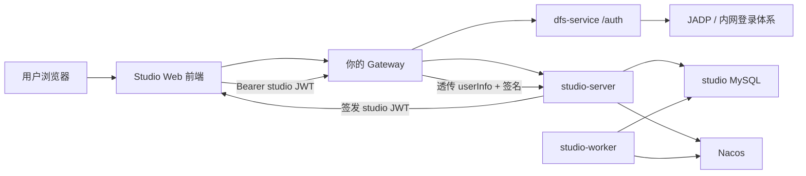
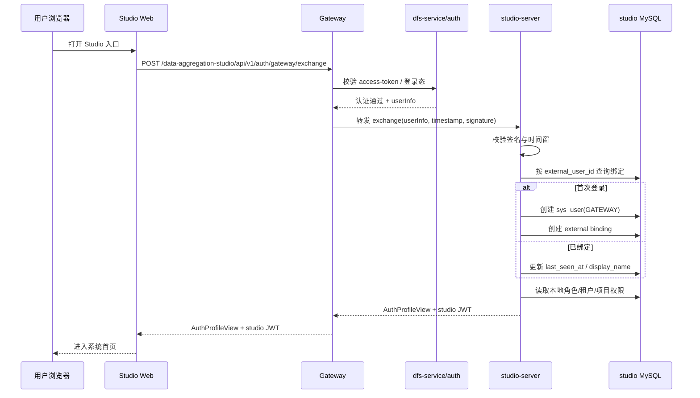
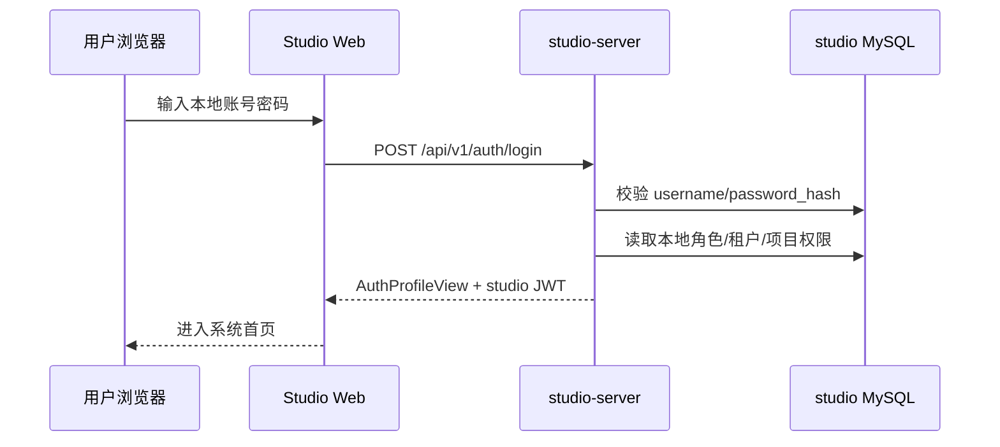
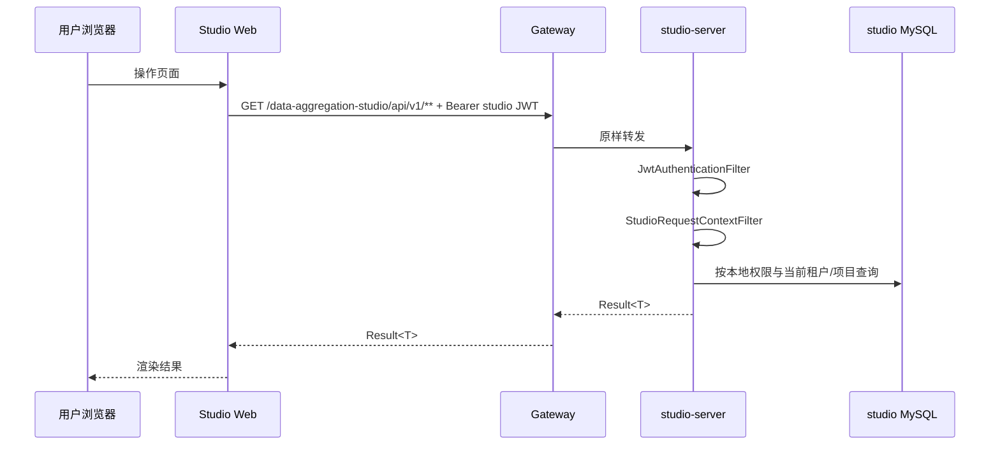

# DataAggregation 与数据资产平台统一认证适配方案

## 文档说明

- 文档目标：沉淀一份可直接执行、可交给后续实施同学拆解开发的适配方案，而不是需求纪要。
- 适配对象：`data-aggregation-studio` 与现有数据资产平台统一登录认证。
- 方案结论：
  - `studio` 与现有数据资产系统共用你的 `gateway` 统一登录认证。
  - 组织结构不做强对齐，不把 `orgId/orgName/orgCode` 作为 `studio` 授权依据。
  - 保留双入口：`gateway` 入口用于统一登录，`studio` 直连入口保留本地账号登录。
  - 保留本地账号并行。
  - 外部用户首次通过 `gateway` 进入 `studio` 时自动建档。
  - `studio-server`、`studio-worker` 一并接入现有 Nacos。
- 核心边界：
  - 认证：由 `gateway + 现有 /auth/JADP` 负责。
  - 授权：由 `studio` 本地 RBAC、租户、项目成员关系负责。

## 1. 背景与目标

当前数据资产平台已经具备统一入口和统一认证链路，核心能力集中在 `cloud-parent` 工作区：

- `gateway-service` 负责统一路由和鉴权入口。
- `platform-data-fusion-service` 中存在 `/auth` 鉴权接口及 JADP/CAS 相关逻辑。
- `platform-common` / `platform-common-dto` 中已有 `userInfo` 上下文透传和解析机制。

与此同时，`data-aggregation-studio` 是一个独立的 Web-first 系统，当前实现位于：

- `C:\dev\ideaProject\DataAggregation\data-aggregation-studio\backend`
- `C:\dev\ideaProject\DataAggregation\data-aggregation-studio\frontend`

`studio` 当前是典型的独立认证模型：

- 本地用户表 `sys_user`
- `/api/v1/auth/login` 用户名密码登录
- 登录成功后签发 `studio JWT`
- 后续所有前端 API 请求走 `Authorization: Bearer <studio-jwt>`

本方案的目标不是让两个系统“用户模型完全一致”，而是让它们“共用同一条登录认证入口”：

1. 平台用户通过你的 `gateway` 访问 `studio` 时，不再重复输入 `studio` 用户名密码。
2. `studio` 仍然保留本地账号体系，方便直连调试、运维和应急登录。
3. `studio` 的租户、项目、角色授权继续留在本地，不强依赖平台组织结构。
4. 后续实施应尽量复用现有平台认证链路，不另起一套 JADP 直连认证。

## 2. 现状梳理

### 2.1 数据资产平台当前认证链路

结合现有仓库代码，平台侧关键认证链路如下：

- `gateway-service` 鉴权入口：
  - `C:\dev\ideaProject\cloud-parent\gateway-service\src\main\java\org\relax\cloud\gateway\config\AuthenticationFilter.java`
- `gateway-service` 路由装配：
  - `C:\dev\ideaProject\cloud-parent\gateway-service\src\main\java\org\relax\cloud\gateway\config\RouteConfig.java`
- `gateway-service` 当前认证开关配置：
  - `C:\dev\ideaProject\cloud-parent\gateway-service\src\main\resources\application.yml`
- `dfs-service /auth` 接口：
  - `C:\dev\ideaProject\cloud-parent\platform-data-fusion-service\src\main\java\com\csgdri\dfs\controller\auth\AuthController.java`
- 下游 `userInfo` 解析：
  - `C:\dev\ideaProject\cloud-parent\platform-common\src\main\java\com\syy\datacenter\interceptor\ContextHolderInterceptor.java`

当前链路特征：

1. `gateway-service` 从请求头、cookie、query 中读取 `access-token`。
2. `gateway-service` 调用 `dfs-service /auth` 做统一鉴权。
3. 鉴权成功后，将 `userInfo` 注入到下游请求头，头名为 `CommonConstants.USER_INFO_KEY`，即 `userInfo`。
4. 下游服务通过 `ContextHolderInterceptor` 将 `userInfo` 解码为 `SysUserVO` 放入 `BaseContextHolder`。
5. 部分下游服务仍然直接依赖 `access-token` 或 cookie，不完全依赖 `userInfo`。

平台侧已确认的重要事实：

- `gateway-service` 当前仓库默认配置中 `auth.enable: false`，但生产环境是否通过 Nacos 覆盖启用需以现网配置为准。
- `gateway-service` 当前路由主要通过 Nacos 自动暴露 `/{service}/**`，不适合作为 `studio` 的正式业务入口。
- 平台用户信息主字段可稳定获取：
  - `userId`
  - `account`
  - `userName` / `name`
  - `orgId`
  - `orgName`
  - `orgCode`

### 2.2 `studio` 当前认证链路

结合 `data-aggregation-studio` 源码，`studio` 当前关键代码如下：

- 安全配置：
  - `C:\dev\ideaProject\DataAggregation\data-aggregation-studio\backend\studio-server\src\main\java\com\jdragon\studio\server\web\config\SecurityConfig.java`
- 登录接口：
  - `C:\dev\ideaProject\DataAggregation\data-aggregation-studio\backend\studio-server\src\main\java\com\jdragon\studio\server\web\controller\AuthController.java`
- JWT 过滤器：
  - `C:\dev\ideaProject\DataAggregation\data-aggregation-studio\backend\studio-server\src\main\java\com\jdragon\studio\server\web\filter\JwtAuthenticationFilter.java`
- 当前用户上下文组装：
  - `C:\dev\ideaProject\DataAggregation\data-aggregation-studio\backend\studio-server\src\main\java\com\jdragon\studio\server\web\filter\StudioRequestContextFilter.java`
- 用户详情加载：
  - `C:\dev\ideaProject\DataAggregation\data-aggregation-studio\backend\studio-infra\src\main\java\com\jdragon\studio\infra\service\StudioUserDetailsService.java`
- 本地权限组装：
  - `C:\dev\ideaProject\DataAggregation\data-aggregation-studio\backend\studio-infra\src\main\java\com\jdragon\studio\infra\service\StudioAccessService.java`
- JWT 服务：
  - `C:\dev\ideaProject\DataAggregation\data-aggregation-studio\backend\studio-infra\src\main\java\com\jdragon\studio\infra\service\JwtTokenService.java`
- 用户表结构：
  - `C:\dev\ideaProject\DataAggregation\data-aggregation-studio\backend\studio-server\src\main\resources\schema-mysql.sql`
- 前端登录页：
  - `C:\dev\ideaProject\DataAggregation\data-aggregation-studio\frontend\apps\web\src\views\LoginView.vue`
- 前端登录状态：
  - `C:\dev\ideaProject\DataAggregation\data-aggregation-studio\frontend\apps\web\src\stores\auth.ts`
- 前端 API 基址与 token 处理：
  - `C:\dev\ideaProject\DataAggregation\data-aggregation-studio\frontend\apps\web\src\api\studio.ts`
  - `C:\dev\ideaProject\DataAggregation\data-aggregation-studio\frontend\packages\api-sdk\src\client.ts`

当前链路特征：

1. `/api/v1/auth/login` 接受用户名密码。
2. 登录成功后由 `JwtTokenService` 生成 `studio JWT`。
3. 前端把 `studio_token` 存在 `localStorage`。
4. 后续 API 请求统一在 `Authorization` 头中携带 `Bearer <token>`。
5. `studio` 本地授权全部依赖 `sys_user`、`sys_user_role`、`studio_tenant_member`、`studio_project_member` 等本地表。

### 2.3 两边不一致的点

两套系统当前不一致点如下：

| 维度 | 数据资产平台 | `studio` |
| --- | --- | --- |
| 登录入口 | `gateway + access-token` | `username/password` |
| 统一用户信息 | `userInfo` 透传 | 本地 `sys_user` |
| 会话表现 | 平台登录态 | `studio JWT` |
| 鉴权入口 | `gateway -> /auth` | Spring Security + JWT |
| 授权模型 | 平台功能权限 | 本地 RBAC + 租户 + 项目 |

结论：

- 统一登录不能只做页面跳转。
- 必须在 `studio` 内新增一层“受信身份交换”，把平台登录态换成 `studio JWT`。
- 这样既能复用平台统一认证，也能保住 `studio` 现有授权体系。

## 3. 设计原则

1. `gateway` 是统一认证入口，`studio` 不直接对接 JADP。
2. `studio` 不接管平台组织树，只消费最小必要用户身份。
3. `studio` 的授权继续由本地表控制，不让组织结构耦合租户/项目授权。
4. `gateway` 入口与 `studio` 直连入口并存，但前者是主入口。
5. 本地账号与外部账号并行存在，但不做静默账号合并。
6. 任何“信任网关透传身份”的能力必须带签名，不能只相信明文 `userInfo`。
7. 外部用户首次自动建档，但默认不自动授予角色或项目权限。
8. 改造应优先复用现有 `studio` JWT、前端路由守卫和 RBAC 逻辑，避免重写整套授权模型。

## 4. 目标架构

目标架构如下：

- `studio-server` 接入 Nacos，服务名固定为 `studio-server`。
- `studio-worker` 接入 Nacos，服务名固定为 `studio-worker`。
- `gateway-service` 新增正式业务前缀 `/data-aggregation-studio/**`。
- `gateway` 对该前缀执行现有平台统一鉴权。
- 认证通过后，`gateway` 将受信用户身份透传给 `studio-server`。
- `studio-server` 将平台身份交换为本地 `studio JWT`。
- 之后前端所有 API 继续按既有方式携带 `studio JWT` 调用。

补充说明：

- `studio-worker` 接入 Nacos 的目的主要是统一治理、统一部署和后续扩展。
- 第一阶段不要求 `gateway` 暴露 `studio-worker` 的公网路由。
- `studio-server -> studio-worker` 的现有内部调用模型不在本次强制重构范围内，先保持现状。

## 5. 认证与授权拆分

| 层级 | 归属系统 | 输入 | 输出 | 说明 |
| --- | --- | --- | --- | --- |
| 平台登录认证 | `gateway + dfs-service/auth + JADP` | `access-token` / 平台登录态 | `userInfo` | 负责判断“是谁” |
| 网关受信透传 | `gateway-service` | `userInfo` | 签名头 + `userInfo` | 负责把可信身份带到 `studio` |
| 身份交换 | `studio-server` | `userInfo + 签名头` | `studio JWT` + `AuthProfileView` | 负责把外部身份接入 `studio` |
| 本地授权 | `studio-server` | `studio JWT` | 菜单、租户、项目、角色 | 负责判断“能做什么” |

认证输入：

- 平台态：`access-token`
- 网关透传：`userInfo`
- 受信签名头：
  - `X-Studio-Gateway-Timestamp`
  - `X-Studio-Gateway-Request-Path`
  - `X-Studio-Gateway-Signature`

认证输出：

- `studio JWT`
- `AuthProfileView`

授权来源：

- `sys_user`
- `sys_user_role`
- `studio_tenant_member`
- `studio_project_member`

明确的非目标：

- 不做组织结构同步。
- 不让 `studio` 项目权限直接依赖平台组织权限。
- 不把 `orgId/orgName/orgCode` 作为 `studio` 当前租户/项目的计算依据。
- 不把平台已有本地账号与 `studio` 现有本地账号做静默合并。

## 6. 详细改造方案

### 6.1 `gateway-service` 改造

#### 6.1.1 路由设计

新增正式业务前缀：

- 外部入口：`/data-aggregation-studio/**`
- 下游目标：`lb://studio-server`
- 转发策略：`StripPrefix=1`

这样可保证：

- 外部正式地址稳定，不暴露默认 `/{service}/**`
- 下游 `studio-server` 仍然保持现有 `/api/v1/**` 接口路径
- 后续前端 API 基址可固定为 `/data-aggregation-studio/api/v1`

建议修改点：

- `C:\dev\ideaProject\cloud-parent\gateway-service\src\main\java\org\relax\cloud\gateway\config\RouteConfig.java`

#### 6.1.2 鉴权执行策略

对 `/data-aggregation-studio/**` 请求执行现有统一鉴权，不重新实现一套新认证。

建议复用现有链路：

1. `gateway-service` 读取平台登录态。
2. 调用 `dfs-service /auth` 做统一鉴权。
3. 从其返回中获取 `userInfo` 头。
4. 对 `studio-server` 转发时附加受信签名头。

重要说明：

- 现有仓库中 `gateway-service` 默认 `auth.enable: false`。
- 上线前必须确认 Nacos 中的实际配置是否已对 `studio` 路由启用认证。
- 如现网未启用，必须在配置中心中显式开启，不建议仅依赖仓库默认值。

#### 6.1.3 透传头协议

`gateway` 向 `studio-server` 转发时，固定透传以下头：

- `userInfo`
- `X-Studio-Gateway-Timestamp`
- `X-Studio-Gateway-Request-Path`
- `X-Studio-Gateway-Signature`

字段定义：

| 头名 | 格式 | 说明 |
| --- | --- | --- |
| `userInfo` | 现有 URL 编码 JSON 字符串 | 直接复用平台现有头值 |
| `X-Studio-Gateway-Timestamp` | `epochMillis` | 统一使用毫秒时间戳 |
| `X-Studio-Gateway-Request-Path` | 字符串 | 使用网关侧原始请求路径，如 `/data-aggregation-studio/api/v1/auth/gateway/exchange` |
| `X-Studio-Gateway-Signature` | Base64 字符串 | HMAC-SHA256 签名结果 |

签名规则固定为：

```text
signaturePayload = userInfo + "\n" + timestamp + "\n" + requestPath
signature = Base64(HMAC_SHA256(signaturePayload, sharedSecret))
```

关键约束：

- `userInfo` 必须对“转发后的实际头值”签名，不重新序列化 JSON。
- `requestPath` 使用 `gateway` 原始可见路径，不使用 `studio-server` 端剥离前缀后的路径。
- `studio-server` 只校验签名头，不依赖来源 IP 来做信任判断。

#### 6.1.4 新增配置项

建议新增配置：

```yaml
studio:
  gateway:
    route-prefix: /data-aggregation-studio
    exchange-path: /api/v1/auth/gateway/exchange
    shared-secret: ${STUDIO_GATEWAY_SHARED_SECRET:change-me}
```

### 6.2 `studio-server` 改造

#### 6.2.1 保留现有本地登录

现有本地登录链路保持不变：

- 保留 `/api/v1/auth/login`
- 保留 `JwtAuthenticationFilter`
- 保留 `studio JWT`
- 保留本地用户名密码登录场景

#### 6.2.2 新增网关身份交换接口

新增接口：

- `POST /api/v1/auth/gateway/exchange`

用途：

- 仅接受经 `gateway` 转发、且签名校验通过的请求
- 将平台统一登录态换成 `studio JWT`

接口契约建议：

- 请求体：空
- 请求头：
  - `userInfo`
  - `X-Studio-Gateway-Timestamp`
  - `X-Studio-Gateway-Request-Path`
  - `X-Studio-Gateway-Signature`
- 返回：`Result<AuthProfileView>`

返回内容与本地登录保持一致：

- `token`
- `userId`
- `username`
- `displayName`
- `currentTenantId`
- `currentProjectId`
- `systemRoleCodes`
- `effectiveRoleCodes`
- `tenants`
- `projects`

#### 6.2.3 签名校验规则

`studio-server` 内部新增受信校验服务，规则固定如下：

1. `studio.gateway-trust-enabled=false` 时，`/auth/gateway/exchange` 直接拒绝。
2. 缺少任一必要头时，返回 `401`。
3. `timestamp` 非法时，返回 `401`。
4. 若 `abs(now - timestamp) > 120000ms`，返回 `401`。
5. 使用与 `gateway` 相同的 `HMAC-SHA256 + Base64` 规则重新计算签名。
6. 签名不一致时，返回 `401`。

新增配置：

```yaml
studio:
  gateway-trust-enabled: true
  gateway-shared-secret: ${STUDIO_GATEWAY_SHARED_SECRET:change-me}
  gateway-signature-expire-seconds: 120
```

#### 6.2.4 用户信息抽取规则

从 `userInfo` 中抽取字段，规则固定为：

| 平台字段 | 用途 | 说明 |
| --- | --- | --- |
| `userId` | 外部稳定主键 | 必填 |
| `account` | 外部账号 | 必填 |
| `userName` | 展示名称优先值 | 可空 |
| `name` | 展示名称回退值 | 可空 |
| `orgId`/`orgName`/`orgCode` | 展示或日志扩展字段 | 不参与授权 |

若缺少 `userId` 或 `account`，直接返回 `400`，不建档。

#### 6.2.5 受信交换后的处理流程

处理流程固定为：

1. 校验签名与时间窗。
2. 解析 `userInfo`。
3. 调用“外部用户绑定/建档服务”。
4. 得到对应 `studio user`。
5. 复用 `StudioAccessService.buildProfile(...)` 计算租户、项目、角色。
6. 用现有 `JwtTokenService` 签发标准 `studio JWT`。
7. 返回与本地登录一致的 `AuthProfileView`。

建议新增代码点：

- `AuthController` 增加 `gatewayExchange()` 方法
- 新增 `GatewayTrustedAuthService`
- 新增 `GatewaySignatureVerifier`
- 新增 `ExternalUserProvisionService`

建议涉及文件：

- `C:\dev\ideaProject\DataAggregation\data-aggregation-studio\backend\studio-server\src\main\java\com\jdragon\studio\server\web\controller\AuthController.java`
- `C:\dev\ideaProject\DataAggregation\data-aggregation-studio\backend\studio-server\src\main\java\com\jdragon\studio\server\web\config\SecurityConfig.java`
- `C:\dev\ideaProject\DataAggregation\data-aggregation-studio\backend\studio-infra\src\main\java\com\jdragon\studio\infra\service`

### 6.3 `studio` 用户模型改造

#### 6.3.1 `sys_user` 增加认证来源

在 `sys_user` 表新增字段：

```sql
alter table sys_user
    add column auth_source varchar(32) not null default 'LOCAL' after username;
```

取值固定：

- `LOCAL`
- `GATEWAY`

作用：

- 区分本地账号和通过网关首次自动建档的账号
- 便于后续用户管理页区分来源

#### 6.3.2 新增外部绑定表

新增表 `studio_external_user_binding`：

```sql
create table if not exists studio_external_user_binding (
    id bigint primary key,
    tenant_id varchar(64) default 'default',
    deleted int default 0,
    created_at datetime default current_timestamp,
    updated_at datetime default current_timestamp,
    provider_code varchar(64) not null,
    external_user_id varchar(128) not null,
    external_account varchar(128),
    studio_user_id bigint not null,
    last_seen_at datetime,
    unique key uk_studio_external_binding_provider_user (provider_code, external_user_id),
    key idx_studio_external_binding_account (provider_code, external_account),
    key idx_studio_external_binding_studio_user (studio_user_id)
);
```

字段定义：

- `provider_code`：固定值 `GATEWAY`
- `external_user_id`：平台 `userId`
- `external_account`：平台 `account`
- `studio_user_id`：绑定到的本地 `sys_user.id`
- `last_seen_at`：最后一次成功通过 gateway 登录的时间

#### 6.3.3 首次自动建档规则

首次自动建档规则固定如下：

1. 按 `(provider_code='GATEWAY', external_user_id=userId)` 查绑定。
2. 若已存在绑定：
   - 读取 `studio_user_id`
   - 更新 `external_account`
   - 更新 `last_seen_at`
   - 如展示名称变化，更新 `sys_user.display_name`
3. 若不存在绑定：
   - 新建 `sys_user`
   - 写入 `studio_external_user_binding`

新建 `sys_user` 规则固定为：

- `auth_source=GATEWAY`
- `tenant_id='default'`
- `enabled=1`
- `display_name` 取值顺序：
  - `userName`
  - `name`
  - `account`
- `password_hash`：生成随机字符串后使用 BCrypt 编码
- `username` 候选顺序：
  1. `account`
  2. `gateway_<account>`
  3. `gateway_<account>_<externalUserId后6位>`
  4. 若仍冲突，继续追加递增序号

#### 6.3.4 明确不做静默账号合并

若 `account` 与本地已有 `LOCAL` 用户同名：

- 不自动把外部用户绑定到本地账号
- 不覆盖已有本地用户密码
- 不复用已有本地用户 `id`
- 而是按上述回退规则生成独立 `GATEWAY` 用户名

该规则必须明确写死，避免出现身份串用风险。

#### 6.3.5 外部用户默认无授权

外部用户首次自动建档时：

- 不自动写入 `sys_user_role`
- 不自动写入 `studio_tenant_member`
- 不自动写入 `studio_project_member`

后续是否可见菜单、项目、租户，完全取决于本地授权表。

### 6.4 `studio` 前端改造

#### 6.4.1 登录页改为双入口

登录页改造成双入口：

- 主入口：`统一登录`
- 次入口：`本地账号登录`

建议 UI 规则：

- 在 gateway 模式下：
  - `统一登录` 按钮置为主按钮
  - 本地账号登录折叠为次级区域
- 在直连模式下：
  - 本地账号表单保持现状
  - `统一登录` 作为跳转入口存在

建议改造文件：

- `C:\dev\ideaProject\DataAggregation\data-aggregation-studio\frontend\apps\web\src\views\LoginView.vue`

#### 6.4.2 gateway 模式识别规则

前端不额外新增模式配置，统一按 `VITE_API_BASE_URL` 判断：

- 若以 `/data-aggregation-studio/` 开头，则视为 gateway 模式
- 否则视为直连模式

#### 6.4.3 统一登录按钮行为

按钮行为固定如下：

1. 若当前为 gateway 模式：
   - 直接调用 `POST /auth/gateway/exchange`
2. 若当前为直连模式且 `VITE_GATEWAY_STUDIO_ENTRY_URL` 已配置：
   - 跳转至该地址
3. 若当前为直连模式但未配置该地址：
   - 给出提示，不执行统一登录

#### 6.4.4 token 与 API 逻辑保持兼容

统一登录成功后：

- 把返回的 `studio JWT` 继续写入现有 `studio_token`
- 继续沿用现有 `localStorage`
- 路由守卫和 API SDK 不重写

这样可以最小代价复用：

- `stores/auth.ts`
- `api/studio.ts`
- `packages/api-sdk/src/client.ts`

#### 6.4.5 API 基址调整

API 基址支持两种模式：

- 直连：`/api/v1`
- gateway：`/data-aggregation-studio/api/v1`

建议前端配置：

```env
VITE_API_BASE_URL=/data-aggregation-studio/api/v1
VITE_GATEWAY_STUDIO_ENTRY_URL=https://<gateway-host>/data-aggregation-studio/login
```

若当前仍是开发联调环境，可保留：

```env
VITE_API_BASE_URL=/api/v1
```

### 6.5 `studio-server` / `studio-worker` 部署改造

#### 6.5.1 接入 Nacos

两者都补充 Nacos 注册中心能力：

- `studio-server`
- `studio-worker`

原则：

- 版本不在 `studio` 内自行发散
- 直接对齐 `cloud-parent` 当前使用的 Spring Cloud / Spring Cloud Alibaba BOM 版本

需要补的内容：

- Maven 依赖
- `spring.cloud.nacos.discovery`
- 如需统一读取配置，再加 `spring.cloud.nacos.config`

#### 6.5.2 服务名固定

服务名固定如下：

- `studio-server`
- `studio-worker`

不要使用其他别名，避免 gateway 路由和 Nacos 服务发现不一致。

#### 6.5.3 对外暴露边界

对外边界固定为：

- 对外业务访问：只开放 `studio-server`
- `studio-worker` 不做公网入口
- `studio-worker` 注册到 Nacos 仅用于治理、部署一致性、后续扩展

#### 6.5.4 当前 `server -> worker` 调用处理策略

本次第一阶段不强制重构 `server -> worker` 调用模型：

- 当前 `studio-worker` 有自己的 `worker-api-base-url`
- 当前 worker 主要靠内部 token、租约、心跳和数据库授权工作
- 本次先完成注册中心接入与统一部署
- 如后续需要多实例负载与服务发现，再单独改 `server -> worker` 的调用方式

## 7. 数据库与配置项清单

### 7.1 数据库变更

| 对象 | 变更 |
| --- | --- |
| `sys_user` | 新增 `auth_source` |
| `studio_external_user_binding` | 新建绑定表 |

### 7.2 `gateway-service` 配置项

| 配置项 | 用途 |
| --- | --- |
| `studio.gateway.shared-secret` | 网关到 `studio-server` 的签名密钥 |
| `studio.gateway.route-prefix` | `studio` 对外正式入口前缀 |
| `studio.gateway.exchange-path` | 统一登录交换接口路径 |

示例：

```yaml
studio:
  gateway:
    route-prefix: /data-aggregation-studio
    exchange-path: /api/v1/auth/gateway/exchange
    shared-secret: ${STUDIO_GATEWAY_SHARED_SECRET:change-me}
```

### 7.3 `studio-server` 配置项

| 配置项 | 用途 |
| --- | --- |
| `studio.gateway-trust-enabled` | 是否启用受信网关交换 |
| `studio.gateway-shared-secret` | 与网关一致的签名密钥 |
| `studio.gateway-signature-expire-seconds` | 签名有效期 |
| `spring.cloud.nacos.discovery.*` | 服务注册 |
| `spring.cloud.nacos.config.*` | 配置中心，可选 |

示例：

```yaml
studio:
  gateway-trust-enabled: true
  gateway-shared-secret: ${STUDIO_GATEWAY_SHARED_SECRET:change-me}
  gateway-signature-expire-seconds: 120
```

### 7.4 前端配置项

| 配置项 | 用途 |
| --- | --- |
| `VITE_API_BASE_URL` | API 基址 |
| `VITE_GATEWAY_STUDIO_ENTRY_URL` | 非 gateway 模式下跳转统一登录入口 |

示例：

```env
VITE_API_BASE_URL=/data-aggregation-studio/api/v1
VITE_GATEWAY_STUDIO_ENTRY_URL=https://<gateway-host>/data-aggregation-studio/login
```

## 8. 交互流程图

### 8.1 总体交互流程图



### 8.2 统一登录时序图



### 8.3 本地账号登录时序图



### 8.4 后续 API 请求时序图



## 9. 执行拆解

### 阶段 1：基础接入

- `studio-server`、`studio-worker` 接入 Nacos。
- `gateway-service` 新增 `studio` 专用路由前缀。
- 明确生产网关配置中 `auth.enable` 与 `/auth` 路径是否开启。

### 阶段 2：后端统一登录打通

- `studio-server` 新增 `/api/v1/auth/gateway/exchange`。
- 完成签名校验逻辑。
- 完成 `sys_user.auth_source` 和 `studio_external_user_binding` 结构改造。
- 完成外部用户首次自动建档与绑定命中逻辑。

### 阶段 3：前端双入口改造

- 登录页改为双入口。
- gateway 模式下接通 `exchange` 登录。
- API baseURL 切换支持 gateway 模式。
- 路由守卫和 token 存储保持兼容。

### 阶段 4：联调与灰度

- 联调平台登录态与 `studio` 受信交换。
- 联调本地账号并行登录。
- 对角色、租户、项目可见性做灰度验证。
- 补上线切换说明和回退预案。

## 10. 验收标准

1. 平台已登录用户从 `gateway` 入口进入 `studio`，无需再次输入 `studio` 账号密码。
2. 首次外部登录能自动建档，但默认无额外授权。
3. 已在 `studio` 本地分配角色/项目权限的外部用户，登录后能看到正确菜单与数据范围。
4. 本地账号登录仍可在直连 `studio` 地址使用。
5. 未经 `gateway` 签名的 `userInfo` 请求不能换取 `studio JWT`。
6. `studio-server`、`studio-worker` 在 Nacos 可发现。
7. `gateway` 可稳定将 `/data-aggregation-studio/**` 转发到 `studio-server`。
8. 同名本地账号不会被外部账号静默覆盖或合并。

## 11. 测试清单

### 11.1 统一登录测试

- 已登录平台用户访问 `gateway` 入口，统一登录成功。
- 未登录平台用户访问 `gateway` 入口，被平台现有登录机制拦截。
- `gateway` 返回的 `userInfo` 中仅保留必要字段时，仍能成功交换。
- `userInfo` 缺少 `userId` 或 `account` 时，交换失败。

### 11.2 安全测试

- 缺失签名头，`exchange` 返回 `401`。
- 时间戳过期，`exchange` 返回 `401`。
- `requestPath` 被篡改，`exchange` 返回 `401`。
- `userInfo` 被篡改，`exchange` 返回 `401`。
- 直连 `studio-server` 手工伪造 `userInfo` 头，不能成功登录。

### 11.3 用户建档测试

- 首次外部登录自动创建 `GATEWAY` 用户。
- 第二次外部登录不重复建档。
- 用户名冲突时回退到 `gateway_` 前缀用户名。
- 外部账号变化时，绑定仍按 `external_user_id` 命中。

### 11.4 授权测试

- 无本地授权的外部用户登录后看不到越权菜单或项目。
- 为外部用户配置本地角色后，菜单正确展示。
- 为外部用户配置项目成员关系后，项目范围正确。

### 11.5 本地账号兼容测试

- 直连地址可继续本地登录。
- `admin/admin123` 默认管理员账号不受影响。
- 本地账号登录后权限计算与改造前一致。

## 12. 风险与注意事项

1. `gateway-service` 仓库默认 `auth.enable=false`，必须确认现网实际配置，否则 `studio` 路由可能不会经过统一认证。
2. `userInfo` 头当前是 URL 编码字符串，签名时必须对“最终转发值”签名，不能在网关和 `studio` 两边各自重新序列化。
3. 本地账号并行意味着必须明确禁止静默账号合并，否则存在身份串用风险。
4. `studio-worker` 接入 Nacos 并不等于本阶段一定要改写所有内部调用链路，范围要控制。
5. 前端 gateway 模式与直连模式下的 API 基址必须清晰，否则容易在开发和生产环境中混淆。

## 13. 回退策略

若灰度阶段出现问题，回退顺序如下：

1. 前端切回直连 `studio` 模式，恢复本地登录为主入口。
2. `gateway` 下线 `/data-aggregation-studio/**` 专用业务路由。
3. `studio-server` 保留本地登录，关闭 `studio.gateway-trust-enabled`。
4. 保留 `auth_source` 与外部绑定表结构，不强制回滚数据。

## 14. 后续实施建议

- 先做后端与网关能力闭环，再做前端统一登录入口。
- 先跑通“统一登录 + 自动建档 + 无授权默认不可见”，再补管理侧的授权分配体验。
- 若未来需要真正的企业级单点体验，可在第二阶段再考虑：
  - 网关统一退出
  - 外部账号绑定管理页
  - 基于平台角色的自动授权映射

## 15. 当前默认假设

- 统一登录继续复用你现有的 `gateway -> dfs-service /auth -> JADP` 链路。
- 平台稳定主键使用 `userId`。
- 平台展示账号使用 `account`。
- 平台展示名称优先使用 `userName`。
- 组织结构字段仅作为展示扩展信息，不参与 `studio` 授权。
- 静态前端资源的最终挂载方式可由现有平台前端容器或静态站点承担，但 API 必须统一经过 `gateway`。
