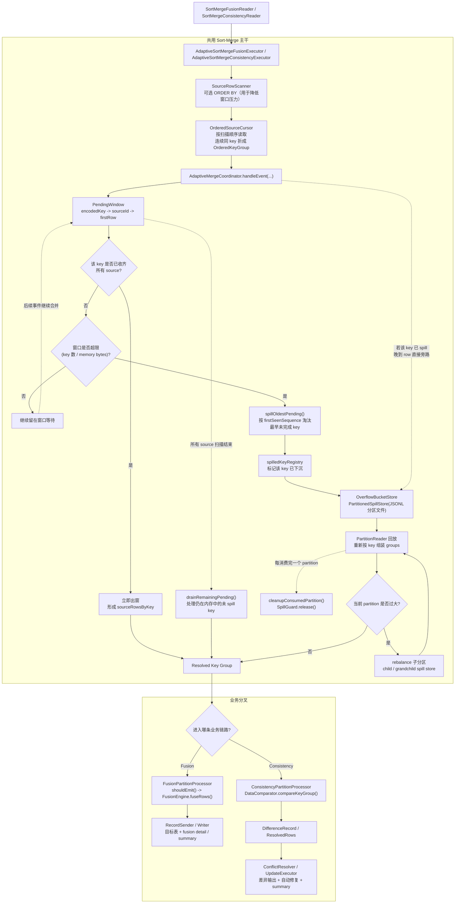
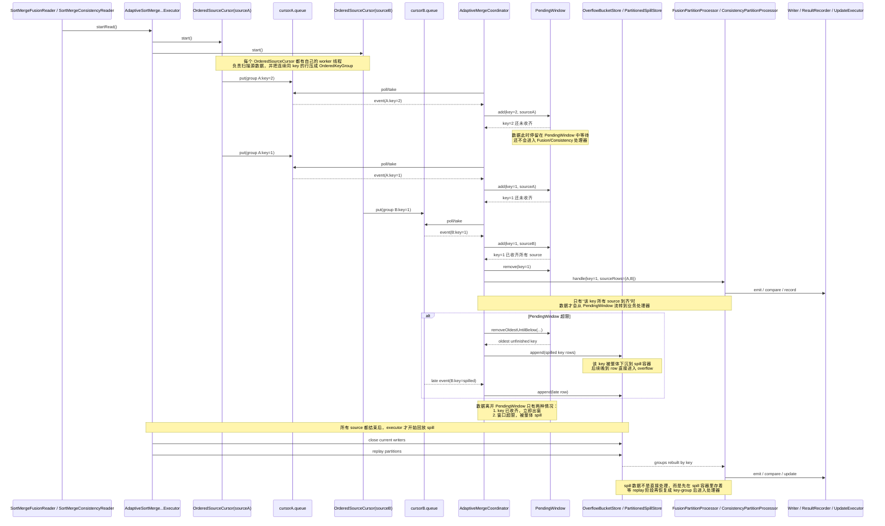
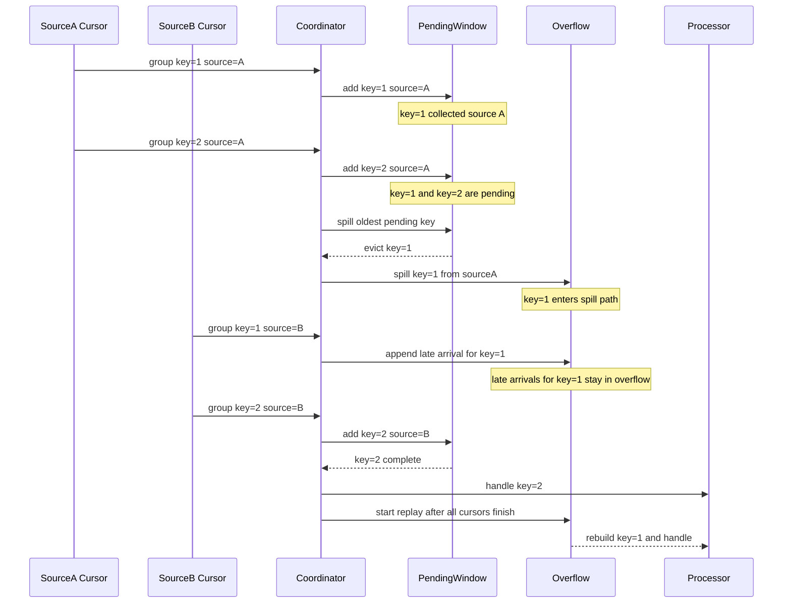
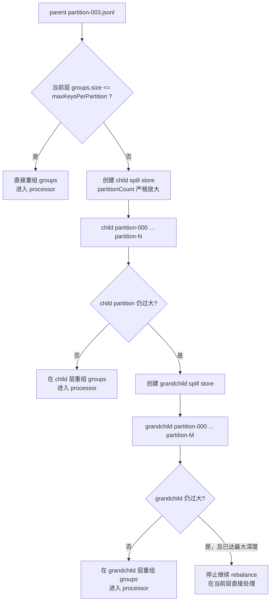

# Fusion与Consistency共用SortMerge数据流转图解

编写时间：2026-04-01 11:03:10  
说明范围：`fusion-sortmerge` 与 `consistency-sortmerge` 共用的核心数据流转逻辑  
核心目标：用一张图看清“源数据进入 -> 等待窗口合并 -> spill 下沉 -> 分区回放 -> fusion/consistency 分叉处理”的完整路径

## 1. 一张图看全链路



## 1.1 实例/容器视角：数据到底待在哪，何时流转

上一张图更偏“模块总览”。  
如果你更关心“数据现在落在哪个实例里、等到什么时候才会被转交出去”，下面这张时序图更直接。



### 这张实例图要这样读

如果你只关心“数据现在在哪个实例里”，可以按下面顺序看：

1. 原始 row 先进入 `OrderedSourceCursor`
2. `OrderedSourceCursor` 把 group 放进自己的 `queue`
3. `AdaptiveMergeCoordinator` 从各个 cursor 的 `queue` 取事件
4. 未收齐的 key 进入 `PendingWindow` 等待
5. 收齐的 key 直接流转到 `FusionPartitionProcessor` 或 `ConsistencyPartitionProcessor`
6. 等不住的 key 流转到 `OverflowBucketStore / PartitionedSpillStore`
7. spill 数据要等到 replay 阶段，才会再次流转到 processor

如果你只关心“等待发生在哪”，答案就两个：

- 等待 source 补齐：发生在 `PendingWindow`
- 等待后续统一回放：发生在 `OverflowBucketStore / PartitionedSpillStore`

## 1.2 停留位置与流转条件总表

| 当前实例/容器 | 里面装的是什么 | 为什么会停在这里 | 满足什么条件才流转 |
| --- | --- | --- | --- |
| `OrderedSourceCursor` | 原始 row 的连续扫描上下文 | 还在做“连续同 key 折组” | 当前组结束，生成 `OrderedKeyGroup` |
| `cursor.queue` | `CursorEvent(group/end/error)` | 等 coordinator 来消费 | `AdaptiveMergeCoordinator.poll/take` 取走事件 |
| `PendingWindow` | `encodedKey -> sourceId -> firstRow` | key 还没收齐，不能进入业务处理 | 1. 所有 source 到齐 2. 窗口超限被 spill 3. 扫描结束被 drain |
| `OverflowBucketStore` | 已下沉的未完成 key 行 | 内存窗口等不住，先写盘 | executor 开始 replay partition |
| `child/grandchild spill store` | 过大 partition 继续 rebalance 后的数据 | 当前 partition 回放时仍装不下 | 子 partition 再次回放，直到 partition 足够小 |
| `FusionPartitionProcessor` | 完整 key-group 的 `sourceRows` | 已经达到 fusion 的处理前提 | `FusionEngine.fuseRows()` 产出记录并写 writer |
| `ConsistencyPartitionProcessor` | 完整 key-group 的 `sourceRows` | 已经达到 consistency 的处理前提 | `DataComparator` 产出差异，后续可 resolve / update |

### 这里说的“容器”，不是部署容器

为了避免歧义，这篇文档里的“容器”指的是**代码里的承载实例**，不是 Docker/K8s 容器。

更准确地说：

- `OrderedSourceCursor`
- `PendingWindow`
- `OverflowBucketStore`
- `PartitionedSpillStore`
- `FusionPartitionProcessor`
- `ConsistencyPartitionProcessor`

这些都是 JVM 进程内的对象实例，或者它们管理的内存 / spill 文件容器。

所以“数据进入哪个容器”可以理解成：

- 先进入哪个对象实例管理的数据结构
- 在哪个数据结构里等待
- 再由哪个实例把它转交给下一个实例

## 1.3 单个 key 的生命周期总表

下面这张表只跟踪一个 key，比如 `biz_id=1001`。

| 阶段 | key 当前所在实例 | 当前保存形态 | 为什么还不能往下走 | 什么时候离开这一阶段 |
| --- | --- | --- | --- | --- |
| 1 | `OrderedSourceCursor` | 原始 row / 当前连续分组上下文 | 还没结束当前连续 key 段 | 连续 key 段结束，生成 `OrderedKeyGroup` |
| 2 | `cursor.queue` | `CursorEvent(group)` | 等 coordinator 消费 | `poll()` 或 `take()` 取走 |
| 3 | `PendingWindow` | `PendingEntry(sourceId -> firstRow)` | key 还没收齐所有 source | 所有 source 到齐，或者窗口超限，或者扫描结束 |
| 4a | `FusionPartitionProcessor` | 完整 `sourceRows` | 无，需要立刻融合 | `FusionEngine.fuseRows()` 完成并写 writer |
| 4b | `ConsistencyPartitionProcessor` | 完整 `sourceRows` | 无，需要立刻比对 | 生成差异、resolve、update 或输出结果 |
| 5 | `OverflowBucketStore` | spill row(JSONL 前的内存写入单元) | 内存窗口暂时容不下 | executor 启动 replay |
| 6 | `PartitionedSpillStore` 某个 partition | JSONL 行 | 还没轮到该 partition 回放 | partition 被读取 |
| 7 | child/grandchild spill store | rebalance 后的新 JSONL 行 | 当前 partition 还是太大 | 更深一层 partition 被读取，直到足够小 |
| 8 | processor | replay 后重组出的完整 `sourceRows` | 无，可以正常处理 | 进入 fusion 或 consistency 业务逻辑 |

## 2. 这张图里最重要的 4 个数据扭转点

### 2.1 扭转点一：原始行变成 `OrderedKeyGroup`

源表里的原始数据先经 `SourceRowScanner` 读取，再进入 `OrderedSourceCursor`。  
这里的职责可以直接表述为：

- 按扫描顺序读数据
- 如果配置了 `preferOrderedQuery=true`，尽量给 SQL 包一层 `ORDER BY`
- 只把“连续相同 key”的多行压成一个 `OrderedKeyGroup`

这里执行的是“连续同 key 折组”。  
`OrderedSourceCursor` 的输出单元是 `OrderedKeyGroup`，每个 group 只保留该连续 key 段的 `firstRow`、`duplicateCount` 和扫描计数。

### 2.2 扭转点二：乱序输入被扭成“按 key 等待合并”

真正的核心在 `AdaptiveMergeCoordinator + PendingWindow`。

当前 `PendingWindow` 采用下面的索引结构：

```text
encodedKey -> PendingEntry
PendingEntry -> sourceId -> firstRow
```

所以它的工作方式是：

1. 新 group 到达后，按 `encodedKey` 找到窗口中的同 key entry
2. 如果这个 source 之前还没到，就把它的 `firstRow` 放进去
3. 如果这个 key 的所有 source 都到齐了，就立刻出窗，交给后面的 processor
4. 如果还没到齐，就继续等待

这里的实现点是：

- 窗口按 `encodedKey` 聚合，而不是按“当前最小 key”推进
- 输入可以出现局部乱序
- 同一个 key 在窗口内收齐后，coordinator 会立即把它交给下游 processor

### 2.3 扭转点三：等不住的 key 被扭到 spill 分区

如果 pending window 超过阈值：

- `pendingKeyThreshold`
- 或 `pendingMemoryMB`

coordinator 会触发 `spillOldestPending()`，把**最早进入窗口但仍未完成**的 key 整体写入 `OverflowBucketStore`。

这一步有两个关键语义：

1. spill 的单位是“整个 key”
   不是单条 row，也不是某个 source 的局部片段

2. 某个 key 一旦 spill，后续晚到数据直接进入 overflow
   它会被 `spilledKeyRegistry` 拦住，并沿同一个 spill 路径继续写入

这样可以保证：

- 同一个 key 不会一半在内存、一半在 spill
- 后面 replay 时，能够重新按 key 完整组装

### 2.4 扭转点四：spill 数据再被扭回 key-group

overflow 中的数据最终会进入 `PartitionReader` 回放。

回放时不是按文件顺序直接处理，而是：

1. 先按分区文件读取 JSONL
2. 再按 `row.key` 重新组装 `groups`
3. 如果当前 partition 太大，再 rebalance 到 child/grandchild 子分区
4. 直到某个 partition 足够小，再交给业务 processor

spill 的处理流程可以直接表述为：

- 先把内存等不住的 key 临时写盘
- 再在回放阶段重新恢复成“按 key 的 sourceRows”
- 最后继续走原来的 fusion / consistency 业务处理

## 3. 一个不 spill 的真实样例

假设有两个 source，join key 是 `biz_id`。

输入顺序：

```text
sourceA: 2(a2), 1(a1), 3(a3)
sourceB: 1(b1), 2(b2), 3(b3)
```

窗口阈值足够大，不会 spill。

实际流转：

1. `sourceA:2` 到达
   - `PendingWindow = { 2 -> {A} }`
   - key=2 还不完整，继续等

2. `sourceA:1` 到达
   - `PendingWindow = { 2 -> {A}, 1 -> {A} }`
   - key=1 还不完整，继续等

3. `sourceB:1` 到达
   - `PendingWindow = { 2 -> {A}, 1 -> {A,B} }`
   - key=1 已收齐，立即出窗
   - 下游拿到 `sourceRows = {A:a1, B:b1}`

4. `sourceB:2` 到达
   - `PendingWindow = { 2 -> {A,B} }`
   - key=2 已收齐，立即出窗

5. `sourceA:3`、`sourceB:3` 到达
   - key=3 也按同样方式出窗

这个例子说明：

- 即使 `sourceA` 是 `2,1,3`
- 系统也不要求先处理最小 key
- 它只关心“同一个 key 有没有凑齐”

## 4. 一个触发 spill 的真实样例

假设：

- `pendingKeyThreshold = 1`
- 两个 source
- 输入顺序：

```text
sourceA: 1(a1), 2(a2)
sourceB: 1(b1), 2(b2)
```

但 `sourceB` 的 `1` 故意延迟。

实际流转：

1. `sourceA:1` 到达
   - `PendingWindow = { 1 -> {A} }`
   - 还没到齐

2. `sourceA:2` 到达
   - `PendingWindow = { 1 -> {A}, 2 -> {A} }`
   - key 数变成 2，超过阈值 1

3. 触发 `spillOldestPending()`
   - 最早进入窗口的是 key=1
   - key=1 整体 spill 到 overflow
   - `spilledKeyRegistry = {1}`
   - `PendingWindow = { 2 -> {A} }`

4. `sourceB:1` 晚到
   - 因为 key=1 已在 `spilledKeyRegistry`
   - 直接写入 overflow

5. `sourceB:2` 到达
   - key=2 在窗口中凑齐
   - 立即出窗处理

6. 最终 replay overflow
   - overflow 中的 `1(a1)` 和 `1(b1)` 再按 key=1 组回一组
   - 然后再交给 fusion / consistency processor

这个例子说明：

- spill 表示该 key 转入磁盘回放阶段
- spill key 会沿 overflow -> partition replay 链路继续处理
- 晚到数据会继续写入同一个 overflow 路径

## 4.1 为什么数据有时会“卡住不动”

从实例视角看，数据没有继续流转，通常只有下面几种原因：

### 情况一：卡在 `cursor.queue`

说明：

- source 已经扫到数据了
- `OrderedSourceCursor` 也已经把 group 放进 queue 了
- 但 `AdaptiveMergeCoordinator` 还没轮到消费这个 queue

这通常只是短暂排队，不是逻辑阻塞。

### 情况二：卡在 `PendingWindow`

这是最常见的“等待”。

说明：

- 当前 key 只到了部分 source
- coordinator 不能把它提前交给 fusion/consistency
- 所以它必须留在 `PendingWindow`

它会一直停在这里，直到满足下面三种情况之一：

1. 所有 source 到齐  
   立即出窗，进入 processor

2. 窗口超限  
   被整体 spill 到 `OverflowBucketStore`

3. 所有 source 都结束  
   由 `drainRemainingPending()` 把剩余 key 处理掉

### 情况三：卡在 `OverflowBucketStore`

说明：

- 这个 key 已经被判断为“当前内存窗口等不住”
- 所以先被写到 spill 文件
- 它不会立刻回到业务处理器

它会一直停在这里，直到：

- 所有 source 扫描完成
- executor 进入 replay 阶段
- 对应 partition 被重新读出并按 key 重组

### 情况四：卡在子分区链路

说明：

- overflow replay 时，某个 partition 仍然太大
- 于是它不会立即进入 processor
- 而是先 rebalance 到 child / grandchild store

这类数据会继续停在子分区层，直到：

- 某一层 partition 足够小
- 可以直接重组成 groups
- 然后再交给 `FusionPartitionProcessor` 或 `ConsistencyPartitionProcessor`

## 5. Fusion 与 Consistency 在哪里分叉

两条链路的**共用部分完全一样**：

```text
Reader
-> Executor
-> SourceRowScanner
-> OrderedSourceCursor
-> AdaptiveMergeCoordinator
-> PendingWindow / OverflowBucketStore / Partition replay
-> Resolved Key Group
```

真正分叉发生在 `Resolved Key Group` 之后。

### 5.1 Fusion 分叉

`fusion` 拿到的是：

```text
key -> { sourceA: rowA, sourceB: rowB, ... }
```

后续流程：

- `FusionPartitionProcessor.shouldEmit()`
- `FusionEngine.fuseRows(sourceRows)`
- `RecordSender.sendToWriter(record)`

也就是说，`fusion` 的关注点是：

- 这个 key 是否满足 `INNER / LEFT / RIGHT / FULL`
- 满足后如何把多源字段融合成一条目标记录

### 5.2 Consistency 分叉

`consistency` 拿到的也是同一份：

```text
key -> { sourceA: rowA, sourceB: rowB, ... }
```

后续流程：

- `DataComparator.compareKeyGroup()`
- 生成 `DifferenceRecord`
- 可选 `ConflictResolver.resolve()`
- 可选 `UpdateExecutor.executeUpdates()`

也就是说，`consistency` 的关注点是：

- 各 source 在这个 key 上是否一致
- 若不一致，差异是什么
- 是否自动修复、如何输出报告、是否写回目标表

## 6. 当前数据推进模型的实现特征

这一套数据推进模型可以直接概括为：

- 原始 row 先被折叠成 `OrderedKeyGroup`
- `AdaptiveMergeCoordinator` 以 `encodedKey` 为单位维护 `PendingWindow`
- key 收齐时立即形成 `Resolved Key Group`
- key 未收齐且窗口超限时，整体写入 `OverflowBucketStore`
- spill 数据在 replay 阶段按 partition 回放，并重新组装成完整 key-group
- 最终由 fusion 或 consistency processor 消费完整 `sourceRows`

按数据形态来看，主链路上的转换顺序是：

- 原始 row
- `OrderedKeyGroup`
- `PendingEntry`
- `Resolved Key Group`
- `sourceRows`
- fusion record 或 difference / resolved result

## 7. 把图直接映射回源码

如果你已经能看懂前面的图，下一步最有用的不是再背一遍概念，而是建立“图上节点 -> 代码入口”的一一对应。

### 7.1 共用主干节点对照

| 图上节点 | 主要类 / 方法 | 这里真正做的事 |
| --- | --- | --- |
| Reader 入口 | `SortMergeFusionReader.startRead()` / `SortMergeConsistencyReader.startRead()` | 解析作业配置，创建 executor，并把 summary / result 回写到 job 上下文 |
| Executor 主入口 | `AdaptiveSortMergeFusionExecutor.execute()` / `AdaptiveSortMergeConsistencyExecutor.execute()` | 组装 `AdaptiveMergeConfig`、`SpillGuard`、`OrderedSourceCursor`，再驱动 coordinator |
| 源数据扫描 | `SourceRowScanner.scan()` | 根据 source 类型选择数据库或文件扫描，把 row 逐条回调出来 |
| 可选排序 SQL | `OrderedSourceCursor.buildScanConfig()` -> `buildOrderedQuery()` | 在 `preferOrderedQuery=true` 时给查询包 `ORDER BY`，作用是降低窗口压力和 spill 概率 |
| 连续同 key 折组 | `OrderedSourceCursor.produceGroups()` / `GroupAccumulator.accept()` / `emitCurrent()` | 把“连续相同 key”的 row 压成一个 `OrderedKeyGroup` |
| 多 cursor 事件调度 | `AdaptiveMergeCoordinator.execute()` | 在多个 cursor 间轮询 `pollEvent()`，必要时阻塞 `takeEvent()` |
| 事件落窗 / 出窗 | `AdaptiveMergeCoordinator.handleEvent()` | 判断该 group 是进入 `PendingWindow`、立即 resolve，还是直接 spill |
| 等待窗口 | `PendingWindow.add()` / `remove()` / `removeOldestUntilBelow()` | 维护 `encodedKey -> PendingEntry`，并按首次进入顺序保留“最老未完成 key” |
| spill 触发点 | `AdaptiveMergeCoordinator.spillOldestPending()` / `spillEntry()` | 把等不住的 key 整体转移到 overflow |
| late arrival 旁路 | `AdaptiveMergeCoordinator.handleEvent()` 中的 `spilledEncodedKeys` 分支 | 某个 key 进入 spill 后，后续晚到数据直接写 overflow |
| overflow 写盘 | `OverflowBucketStore.append()` -> `PartitionedSpillStore.append()` | 把 row 按 hash 分区写成 JSONL |
| partition 回放 | `processOverflowStore()` -> `processPartitionPath()` | 读取某个 partition，按 key 重建 `groups`，必要时继续 rebalance |
| 已消费分区清理 | `PartitionedSpillStore.cleanupConsumedPartition()` | 删除已回放的 partition 文件，并通过 `SpillGuard.release()` 归还占用 |

### 7.2 Fusion 分叉节点对照

| 图上节点 | 主要类 / 方法 | 这里真正做的事 |
| --- | --- | --- |
| Fusion 处理入口 | `FusionPartitionProcessor.processGroups()` | 遍历每个完整 key-group，准备交给融合引擎 |
| join 语义判断 | `FusionPartitionProcessor.shouldEmit()` | 根据 `INNER / LEFT / RIGHT / FULL` 判断该 key 是否应该输出 |
| 真正融合 | `FusionPartitionProcessor` 通过反射调用 `FusionEngine.fuseRows(Map)` | 产出目标 `Record`；字段映射为空时进入 `fuseRowsLegacy(...)` 路径 |
| 结果下发 | `RecordSender.sendToWriter()` | 把融合后的记录交给 writer |
| detail / summary | `FusionContext.recordProcessed()` / `recordSkipped()` / `saveFusionDetails()` | 维护处理计数，并输出融合详情文件 |

这一段可以概括为：

- `FusionPartitionProcessor` 自己不做字段融合
- 它只判断该不该发射，再把完整 `sourceRows` 交给 `FusionEngine`
- Fusion 分叉点的核心方法是 `shouldEmit()` 与 `fuseRows()`

### 7.3 Consistency 分叉节点对照

| 图上节点 | 主要类 / 方法 | 这里真正做的事 |
| --- | --- | --- |
| Consistency 处理入口 | `ConsistencyPartitionProcessor.processGroups()` | 遍历每个完整 key-group，并调用比较器 |
| 差异判断 | `DataComparator.compareKeyGroup()` | 补齐 missing source、比较 `compareFields`、生成 `DifferenceRecord` |
| 差异暂存 | `AppendOnlySpillList<DifferenceRecord>.add()` | 差异和 resolved 差异都可以走 spill-backed list，避免结果过大时纯内存堆积 |
| 冲突解决 | `ConflictResolver.canResolve()` / `resolve()` | 可选生成 `ResolutionResult` |
| resolved row 暂存 | `resolvedRows.add(...)` | 把自动解出来的目标行保存在 spill-backed list |
| 自动回写 | `UpdateExecutor.executeUpdates()` | 在 `autoApplyResolutions=true` 时把 update plan 应用到目标 source |
| 结果落盘 / 报告 | `recordResults()` / `FileResultRecorder` | 输出差异文件、resolution 和 HTML report |

所以 consistency 分叉比 fusion 多了一层：

- 先比较
- 再决定是否 resolve
- 再决定是否 update

它们共用的是同一套 key-group 流转主干，不共用的是 group 到达后的业务语义。

## 8. 事件时间线图

下面这张图把“事件按时间推进”单独展开，展示 coordinator 实际接收到的事件顺序和窗口状态变化。



这张图最适合回答 3 个问题：

1. 为什么同一个 key 会突然“从窗口里消失”
   因为它可能不是被处理了，而是被 spill 了

2. 为什么晚到 row 有时直接进入 overflow
   因为该 key 一旦进入 `spilledEncodedKeys`，后续事件会沿 spill 路径继续写入

3. 为什么 spill 数据不是立刻进入 processor
   因为它必须先等所有 source 结束，再按 partition 回放并重组成 key-group

## 9. spill 分区树图：parent / child / grandchild 到底是什么关系

child / grandchild spill store 表示同一批 spill 数据在回放阶段继续分桶的层级关系。  
它表达的是“当前 partition 仍然过大，因此继续按更细粒度分区回放”的内存保护链路。



这张图有 5 个关键点：

1. parent / child / grandchild 表示同一批 spill 数据的不同回放层级
   它们共享同一条业务处理主干，只是回放深度不同

2. 每进入下一层，分区数都会严格变大
   `StreamExecutionOptions.getRebalancePartitionCount()` 会保证子层分区数大于父层，不会原地打转

3. 当前层一旦决定 rebalance，已聚到内存里的 groups 会被整批搬去子层
   然后当前层 `groups.clear()`，避免同一批 key 在父层和子层各处理一次

4. 每消费完一个 partition，都会调用 `cleanupConsumedPartition()`
   所以 partition 文件不是一直累积，而是边回放边清理

5. rebalance 深度不是无限的
   当前 fusion / consistency 两条实现里都把 `MAX_REBALANCE_DEPTH` 设成了 `3`
   到了最大深度后，即使 partition 仍偏大，也会在当前层直接进入 processor

spill 分区树表达的是：

- 某个超大 partition 被继续拆分
- 经过更细粒度的回放后，再恢复到 processor 消费的完整 key-group

## 10. 排序语义与 key 汇合条件

当前实现里的匹配与推进语义可以直接表述为：

```text
处理正确性建立在 key 汇合与 replay 重组之上，
排序用于降低 PendingWindow 压力和 spill 规模。
```

这意味着：

- `OrderedSourceCursor` 可以在 `preferOrderedQuery=true` 时追加 `ORDER BY`
- coordinator 的匹配单元始终是 `encodedKey`
- 同一个业务 key 可以先在 `PendingWindow` 汇合
- 未在窗口内汇合完成的 key，会进入 overflow 并在 replay 阶段重新组装

数据库字符集、排序规则和数据源类型会影响扫描顺序与窗口压力，典型因素包括：

- 不同数据库的字符集 / 校对规则不同
- `NULL` 排序位置不同
- 同样是字符串 key，`10` 和 `2` 可能按字符顺序而不是数值顺序排列
- 文件、对象存储或自定义 SQL 本身不保证全局顺序
- 不同端对大小写、空串、中文、特殊符号的排序规则可能不同

这些差异会直接影响：

- 某个 key 进入 `PendingWindow` 的先后次序
- `PendingWindow` 的峰值大小
- spill 是否触发，以及 spill 数据量

这些差异不会改变的，是 key 的匹配判定方式：

- 只要各 source 对同一个业务 key 编成相同的 `encodedKey`
- 该 key 就可以在窗口内或 replay 阶段被重新汇合
- downstream processor 接收到的仍然是完整的 `sourceRows`

### 10.1 当前实现依赖的前提

1. 各 source 对同一个业务 key 的编码结果要一致
   `OrderedKey.fromRow(...)` 最终会把 key 编成 `encodedKey`，coordinator 围绕这个值做匹配

2. join key 的等值语义需要由上游字段准备好
   如果业务要求大小写不敏感、去空格、统一日期格式，需要在 query 或 field mapping 层先完成规范化

3. 当前主链路处理的是“每个 source 在该 key 上的 firstRow”
   processor 消费的是 `sourceId -> firstRow` 形态的数据，不展开一对多组合

### 10.2 一句话概括

```text
数据先按 key 汇合，再进入业务处理；
未在窗口内汇合完成的 key，沿 spill 与 replay 链路完成重组。
```
