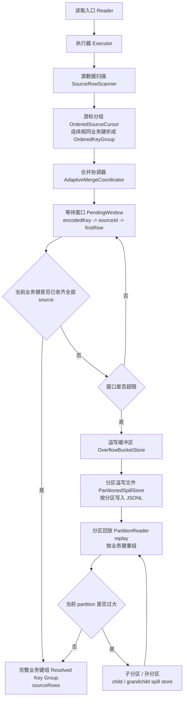
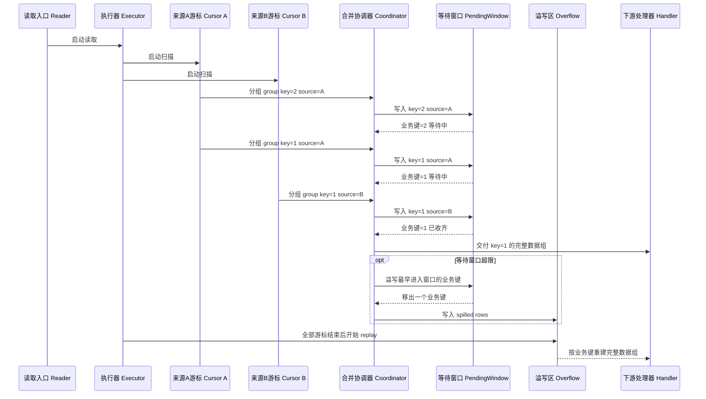
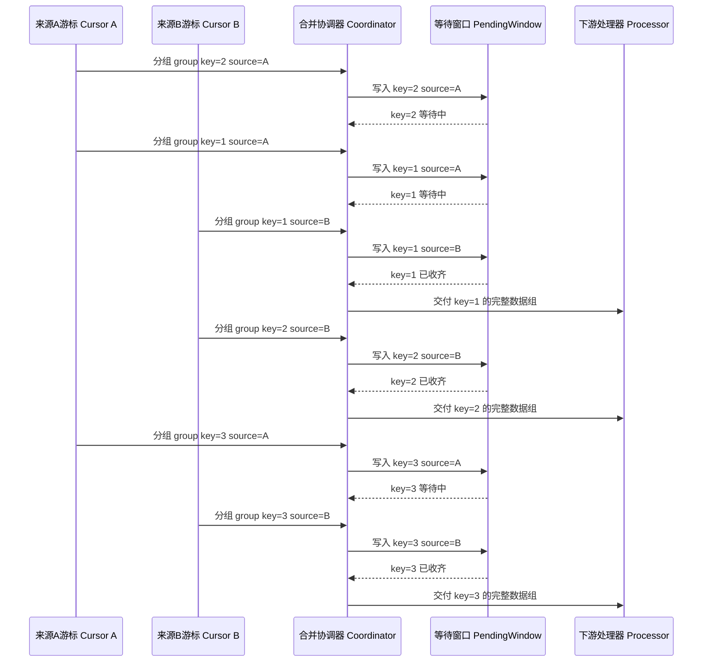
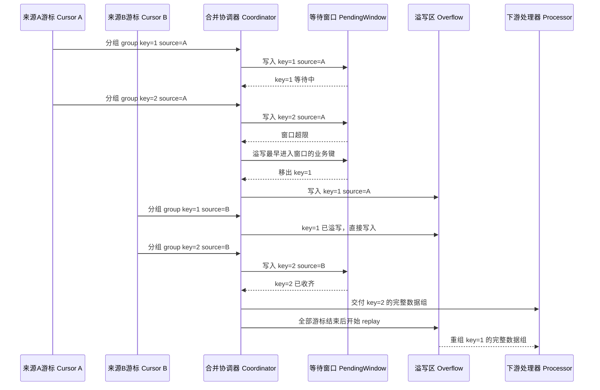
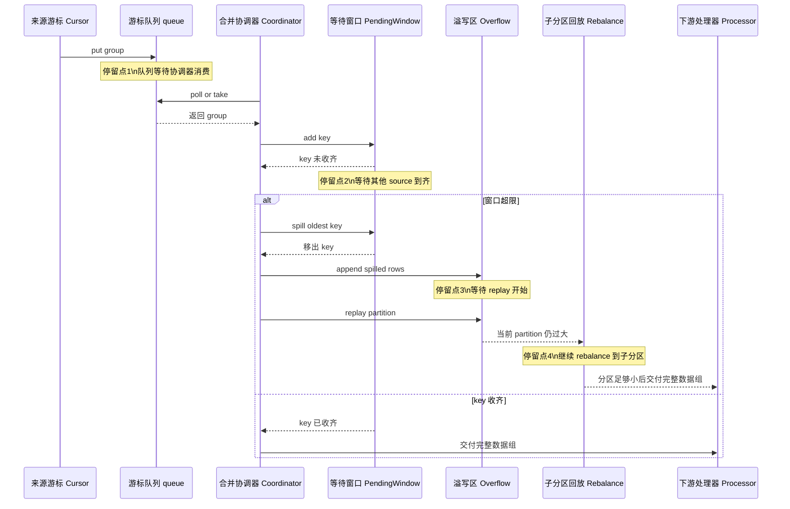
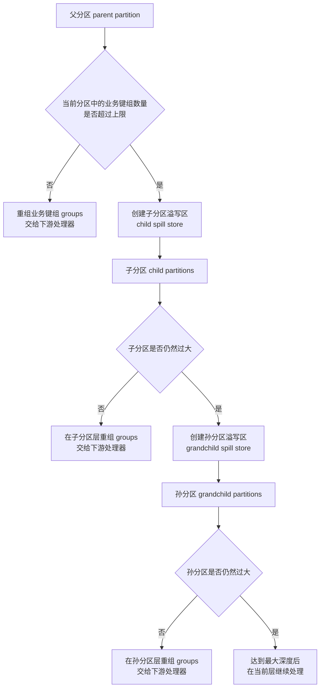

<a id="top"></a>
# SortMerge 底层实现与 Fusion / Consistency 围绕 SortMerge 的实现细节说明

编写时间：2026-04-01 11:03:10  
说明范围：`fusion-sortmerge` 与 `consistency-sortmerge` 的共用底层 `sortmerge` 主干，以及两条业务链围绕该主干的实现方式  
核心目标：按数据推进顺序看清“源数据进入 -> 等待窗口合并 -> spill 下沉 -> 分区回放 -> 业务处理”的完整路径

锚点目录：

- [1. 共用底层 SortMerge](#common-sortmerge)
- [1.1 共用主链路总览](#common-overview)
- [1.2 实例与容器视角](#common-instance-flow)
- [1.6 不 spill 的真实样例](#sample-no-spill)
- [1.7 触发 spill 的真实样例](#sample-spill)
- [1.8 为什么数据会卡住不动](#stuck-cases)
- [1.9 溢写分区树](#spill-tree)
- [1.10 排序语义与 key 汇合条件](#ordering-semantics)
- [1.11 共用主干源码对照](#common-code-map)
- [2. Fusion 如何围绕 SortMerge 实现](#fusion-impl)
- [2.1 Fusion 的入口与初始化](#fusion-entry)
- [2.2 Fusion 的执行链路](#fusion-flow)
- [2.3 Fusion 在完整 key-group 上做什么](#fusion-group-processing)
- [2.4 Fusion 的附加输出](#fusion-outputs)
- [2.5 Fusion 源码对照](#fusion-code-map)
- [3. Consistency 如何围绕 SortMerge 实现](#consistency-impl)
- [3.1 Consistency 的入口与初始化](#consistency-entry)
- [3.2 Consistency 的执行链路](#consistency-flow)
- [3.3 Consistency 在完整 key-group 上做什么](#consistency-group-processing)
- [3.4 Consistency 的附加输出](#consistency-outputs)
- [3.5 Consistency 源码对照](#consistency-code-map)

<a id="common-sortmerge"></a>
## 1. Fusion 与 Consistency 共用的底层 SortMerge

这一部分只描述两条链路共用的主干，不展开 Fusion 和 Consistency 各自的业务语义。

<a id="common-overview"></a>
### 1.1 共用主链路总览



这条主链路表达的是：

1. 读取入口启动各自的执行器
2. 执行器扫描数据源，并把原始行折成 `OrderedKeyGroup`
3. 合并协调器以 `encodedKey` 为单位维护 `PendingWindow`
4. 业务键收齐后立即形成 `Resolved Key Group`
5. 未收齐且窗口超限的业务键下沉到 overflow
6. overflow 数据在 replay 阶段重新组装成完整 key-group
7. 完整 key-group 再交给各自的业务处理器

<a id="common-instance-flow"></a>
### 1.2 实例/容器视角：数据待在哪，何时流转

下面这张图只展示共用底层里的实例流转，不区分 Fusion / Consistency 的具体处理器。



如果只关心“数据现在停在哪里”，可以按下面顺序理解：

1. 原始 row 先进入 `OrderedSourceCursor`
2. `OrderedSourceCursor` 把 group 放进自己的 `queue`
3. `AdaptiveMergeCoordinator` 从各个 cursor 的 `queue` 取事件
4. 未收齐的 key 进入 `PendingWindow`
5. 收齐的 key 形成 `Resolved Key Group`
6. 等不住的 key 进入 `OverflowBucketStore / PartitionedSpillStore`
7. spill 数据在 replay 阶段重新形成 `Resolved Key Group`

### 1.3 停留位置与流转条件总表

| 当前实例/容器 | 里面装的是什么 | 为什么会停在这里 | 满足什么条件才流转 |
| --- | --- | --- | --- |
| `OrderedSourceCursor` | 原始 row 的连续扫描上下文 | 还在做“连续同 key 折组” | 当前组结束，生成 `OrderedKeyGroup` |
| `cursor.queue` | `CursorEvent(group/end/error)` | 等 coordinator 消费 | `AdaptiveMergeCoordinator.poll/take` 取走事件 |
| `PendingWindow` | `encodedKey -> sourceId -> firstRow` | key 还没收齐，不能进入业务处理 | 1. 所有 source 到齐 2. 窗口超限被 spill 3. 扫描结束被 drain |
| `OverflowBucketStore` | 已下沉的未完成 key 行 | 内存窗口等不住，先写盘 | executor 开始 replay partition |
| `PartitionedSpillStore` 某个 partition | spill JSONL 行 | 还没轮到该 partition 回放 | partition 被读取 |
| `child/grandchild spill store` | rebalance 后的新 partition 数据 | 当前 partition 回放时仍装不下 | 子 partition 再次回放，直到 partition 足够小 |
| `ResolvedGroupHandler` | 完整 key-group 的 `sourceRows` | 已经满足下游业务处理前提 | 交给 Fusion 或 Consistency 处理器 |

### 1.4 单个 key 的生命周期总表

下面这张表只跟踪一个 key，比如 `biz_id=1001`。

| 阶段 | key 当前所在实例 | 当前保存形态 | 为什么还不能往下走 | 什么时候离开这一阶段 |
| --- | --- | --- | --- | --- |
| 1 | `OrderedSourceCursor` | 原始 row / 当前连续分组上下文 | 还没结束当前连续 key 段 | 连续 key 段结束，生成 `OrderedKeyGroup` |
| 2 | `cursor.queue` | `CursorEvent(group)` | 等 coordinator 消费 | `poll()` 或 `take()` 取走 |
| 3 | `PendingWindow` | `PendingEntry(sourceId -> firstRow)` | key 还没收齐所有 source | 所有 source 到齐，或者窗口超限，或者扫描结束 |
| 4 | `OverflowBucketStore` | spill row 写入单元 | 当前 key 已转入 spill 路径 | executor 启动 replay |
| 5 | `PartitionedSpillStore` 某个 partition | JSONL 行 | 当前 partition 尚未回放 | partition 被读取 |
| 6 | child / grandchild spill store | rebalance 后的新 JSONL 行 | 当前 partition 仍然过大 | 更深一层 partition 被读取 |
| 7 | `ResolvedGroupHandler` | replay 后重组出的完整 `sourceRows` | 无 | 进入下游业务处理器 |

### 1.5 四个关键扭转点

#### 1.5.1 原始行变成 `OrderedKeyGroup`

源表里的原始数据先经 `SourceRowScanner` 读取，再进入 `OrderedSourceCursor`。

这里执行的是“连续同 key 折组”：

- 按扫描顺序读数据
- 在 `preferOrderedQuery=true` 时，尽量给 SQL 包一层 `ORDER BY`
- 把连续相同 key 的多行折叠成一个 `OrderedKeyGroup`

`OrderedKeyGroup` 中保留的核心内容是：

- `key`
- `firstRow`
- `duplicateCount`
- `scannedRecords`

#### 1.5.2 `OrderedKeyGroup` 进入 `PendingWindow`

真正的合并核心在 `AdaptiveMergeCoordinator + PendingWindow`。

`PendingWindow` 的索引结构是：

```text
encodedKey -> PendingEntry
PendingEntry -> sourceId -> firstRow
```

它的工作方式是：

1. 新 group 到达后，按 `encodedKey` 找到窗口中的同 key entry
2. 如果当前 source 之前还没到，就把 `firstRow` 放进去
3. 如果该 key 的所有 source 都到齐了，就立刻出窗
4. 如果还没到齐，就继续留在窗口等待

这里的实现点是：

- 窗口按 `encodedKey` 聚合
- 输入允许出现局部乱序
- 同一个 key 在窗口内收齐后，会立即交给下游 handler

#### 1.5.3 未收齐 key 进入 spill

如果 `PendingWindow` 超过阈值：

- `pendingKeyThreshold`
- 或 `pendingMemoryMB`

coordinator 会触发 `spillOldestPending()`，把最早进入窗口但仍未完成的 key 整体写入 `OverflowBucketStore`。

这里的两个关键语义是：

1. spill 的单位是“整个 key”
   不是单条 row，也不是某个 source 的局部片段

2. 某个 key 一旦 spill，后续晚到数据会直接进入 overflow
   它会被 `spilledEncodedKeys` 拦住，并沿同一条 spill 路径继续写入

#### 1.5.4 spill 数据重新变回完整 key-group

overflow 中的数据会进入 `PartitionReader` 回放。

回放时执行的是：

1. 读取某个 partition 的 JSONL
2. 按 `row.key` 重新组装 `groups`
3. 如果 partition 仍然过大，就 rebalance 到 child / grandchild spill store
4. 当某一层 partition 足够小时，再把完整 `sourceRows` 交给下游 handler

<a id="sample-no-spill"></a>
### 1.6 一个不 spill 的真实样例

假设有两个 source，join key 是 `biz_id`。

输入顺序：

```text
sourceA: 2(a2), 1(a1), 3(a3)
sourceB: 1(b1), 2(b2), 3(b3)
```

窗口阈值足够大，不会 spill。

对应时序图：



按时间解释：

1. `sourceA:2` 到达
   - `PendingWindow = { 2 -> {A} }`
   - key=2 还不完整

2. `sourceA:1` 到达
   - `PendingWindow = { 2 -> {A}, 1 -> {A} }`
   - key=1 还不完整

3. `sourceB:1` 到达
   - `PendingWindow = { 2 -> {A}, 1 -> {A,B} }`
   - key=1 已收齐
   - 下游拿到 `sourceRows = {A:a1, B:b1}`

4. `sourceB:2` 到达
   - `PendingWindow = { 2 -> {A,B} }`
   - key=2 已收齐

5. `sourceA:3`、`sourceB:3` 到达
   - key=3 也按同样方式出窗

这个例子说明：

- 系统不要求先处理最小 key
- 系统只关心“同一个 key 是否已经收齐”
- 时序图里可以直接看到：虽然 `key=2` 先进入窗口，但 `key=1` 先被收齐，因此 `key=1` 先出窗处理

<a id="sample-spill"></a>
### 1.7 一个触发 spill 的真实样例

假设：

- `pendingKeyThreshold = 1`
- 两个 source
- 输入顺序：

```text
sourceA: 1(a1), 2(a2)
sourceB: 1(b1), 2(b2)
```

但 `sourceB` 的 `1` 故意延迟。

对应时序图：



按时间解释：

1. `sourceA:1` 到达
   - `PendingWindow = { 1 -> {A} }`

2. `sourceA:2` 到达
   - `PendingWindow = { 1 -> {A}, 2 -> {A} }`
   - key 数变成 2，超过阈值 1

3. 触发 `spillOldestPending()`
   - 最早进入窗口的是 key=1
   - key=1 整体 spill 到 overflow
   - `spilledKeyRegistry = {1}`
   - `PendingWindow = { 2 -> {A} }`

4. `sourceB:1` 晚到
   - 因为 key=1 已在 `spilledKeyRegistry`
   - 直接写入 overflow

5. `sourceB:2` 到达
   - key=2 在窗口中凑齐
   - 立即出窗处理

6. 最终 replay overflow
   - overflow 中的 `1(a1)` 和 `1(b1)` 再按 key=1 组回一组
   - 然后交给下游 handler

这个例子说明：

- spill 表示该 key 转入磁盘回放阶段
- spill key 会沿 overflow -> partition replay 链路继续处理
- 晚到数据会继续写入同一个 overflow 路径
- 时序图里可以直接看到：`key=1` 先进入窗口，但因为超限被整体转入 overflow，最终在 replay 阶段才重新交付下游

<a id="stuck-cases"></a>
### 1.8 为什么数据有时会“卡住不动”

从实例视角看，数据没有继续流转，通常只有下面几种原因：

对应时序图：



这张图里的 4 个“停留点”分别对应下面 4 种情况。

#### 情况一：卡在 `cursor.queue`

说明：

- source 已经扫到数据
- `OrderedSourceCursor` 也已经把 group 放进 queue
- `AdaptiveMergeCoordinator` 还没轮到消费这个 queue

对应上图：

- 对应“停留点1”
- 发生在 `put group` 之后、`poll or take` 之前

这通常只是短暂排队。

#### 情况二：卡在 `PendingWindow`

说明：

- 当前 key 只到了部分 source
- coordinator 还不能把它交给下游业务处理器
- 所以它必须留在 `PendingWindow`

对应上图：

- 对应“停留点2”
- 发生在 `add key` 之后、`key 已收齐` 或 `spill oldest key` 之前

它会停在这里，直到满足下面任一条件：

1. 所有 source 到齐
2. 窗口超限并被整体 spill
3. 所有 source 都结束，由 `drainRemainingPending()` 处理

#### 情况三：卡在 `OverflowBucketStore`

说明：

- 这个 key 已经被判断为“当前内存窗口等不住”
- 所以先被写入 spill 文件
- 它不会立刻回到下游业务处理器

对应上图：

- 对应“停留点3”
- 发生在 `append spilled rows` 之后、`replay partition` 之前

它会停在这里，直到：

- 所有 source 扫描完成
- executor 进入 replay 阶段
- 对应 partition 被重新读出并按 key 重组

#### 情况四：卡在子分区链路

说明：

- overflow replay 时，某个 partition 仍然太大
- 当前层会继续 rebalance 到 child / grandchild spill store

对应上图：

- 对应“停留点4”
- 发生在 `当前 partition 仍过大` 之后、`分区足够小后交付完整数据组` 之前

这类数据会继续停在子分区层，直到某一层 partition 足够小，再恢复成完整 key-group。

<a id="spill-tree"></a>
### 1.9 溢写分区树：父分区、子分区、孙分区的关系

父分区、子分区、孙分区表示同一批 spill 数据在回放阶段继续分桶的层级关系。



这张图表达的是：

1. 父分区、子分区、孙分区表示同一批 spill 数据的不同回放层级
2. 每进入下一层，分区数都会严格变大
3. 当前层一旦决定 rebalance，已收集到的 groups 会整体搬去子层
4. 每消费完一个 partition，都会调用 `cleanupConsumedPartition()`
5. `MAX_REBALANCE_DEPTH` 限制了递归 rebalance 的最大深度

<a id="ordering-semantics"></a>
### 1.10 排序语义与 key 汇合条件

当前实现里的推进语义可以直接表述为：

```text
处理正确性建立在 key 汇合与 replay 重组之上，
排序用于降低 PendingWindow 压力和 spill 规模。
```

这意味着：

- `OrderedSourceCursor` 可以在 `preferOrderedQuery=true` 时追加 `ORDER BY`
- coordinator 的匹配单元始终是 `encodedKey`
- 同一个业务 key 可以先在 `PendingWindow` 汇合
- 未在窗口内汇合完成的 key，会进入 overflow 并在 replay 阶段重新组装

会影响扫描顺序与窗口压力的因素包括：

- 不同数据库的字符集 / 校对规则
- `NULL` 排序位置
- 字符串 key 的排序方式
- 文件、对象存储或自定义 SQL 的自然输出顺序
- 大小写、空串、中文、特殊符号的排序规则

这些因素会影响：

- 某个 key 进入 `PendingWindow` 的先后次序
- `PendingWindow` 的峰值大小
- spill 是否触发，以及 spill 数据量

这些因素不会改变的，是 key 的匹配判定方式：

- 只要各 source 对同一个业务 key 编成相同的 `encodedKey`
- 该 key 就可以在窗口内或 replay 阶段重新汇合
- 下游业务处理器接收到的仍然是完整的 `sourceRows`

<a id="common-code-map"></a>
### 1.11 共用主干源码对照

| 主干节点 | 主要类 / 方法 | 作用 |
| --- | --- | --- |
| reader 入口 | `SortMergeFusionReader.startRead()` / `SortMergeConsistencyReader.startRead()` | 启动各自 executor |
| executor 主入口 | `AdaptiveSortMergeFusionExecutor.execute()` / `AdaptiveSortMergeConsistencyExecutor.execute()` | 组装 sortmerge 执行环境 |
| 源数据扫描 | `SourceRowScanner.scan()` | 根据 source 类型读取 row |
| 连续同 key 折组 | `OrderedSourceCursor.produceGroups()` / `GroupAccumulator.accept()` | 形成 `OrderedKeyGroup` |
| 多 cursor 事件调度 | `AdaptiveMergeCoordinator.execute()` | 轮询各个 cursor 的事件 |
| 事件落窗 / 出窗 | `AdaptiveMergeCoordinator.handleEvent()` | 决定进入窗口、立即 resolve 或 spill |
| 等待窗口 | `PendingWindow.add()` / `remove()` / `removeOldestUntilBelow()` | 维护 `encodedKey -> PendingEntry` |
| spill 触发 | `AdaptiveMergeCoordinator.spillOldestPending()` / `spillEntry()` | 把未完成 key 转入 overflow |
| late arrival 旁路 | `AdaptiveMergeCoordinator.handleEvent()` 中的 `spilledEncodedKeys` 分支 | spill key 的晚到数据直接写 overflow |
| overflow 写盘 | `OverflowBucketStore.append()` -> `PartitionedSpillStore.append()` | 按 hash 分区写成 JSONL |
| partition 回放 | `processOverflowStore()` -> `processPartitionPath()` | 从 spill 重建 `groups` |
| 分区清理 | `PartitionedSpillStore.cleanupConsumedPartition()` | 删除已消费 partition 并归还 spill 预算 |

<a id="fusion-impl"></a>
## 2. Fusion 如何围绕 SortMerge 实现

这一部分只描述 Fusion 在共用 `sortmerge` 主干之上的接入方式与业务处理方式。

<a id="fusion-entry"></a>
### 2.1 Fusion 的入口与初始化

Fusion 的入口类是 `SortMergeFusionReader`。

初始化阶段由 `SortMergeFusionReader.init()` 完成，主要做下面几件事：

1. 通过 `FusionConfig.fromConfig()` 解析 reader 配置
2. 调用 `fusionConfig.validate()` 校验配置
3. 创建 `FusionContext`
4. 从 peer writer 配置里读取 `targetColumns`
5. 绑定 `jobPointReporter`
6. 初始化增量位点信息
7. 调用 `FusionStrategyFactory.initDefaultStrategies()`

启动阶段由 `SortMergeFusionReader.startRead()` 完成：

1. 创建 `AdaptiveSortMergeFusionExecutor`
2. 调用 `executor.execute(recordSender)`
3. 执行完成后保存 fusion detail
4. 把 `SortMergeStats` 写入 `fusion_sortmerge_summary`

收尾阶段由 `SortMergeFusionReader.post()` 完成：

1. 从 `FusionDetailOutput.Summary` 读取汇总信息
2. 把汇总写入 `fusion_summary`

<a id="fusion-flow"></a>
### 2.2 Fusion 围绕 SortMerge 的执行链路

Fusion 围绕共用主干的执行顺序可以概括为：

1. `AdaptiveSortMergeFusionExecutor.execute()` 读取 `cache`、`performance`、`adaptiveMerge` 配置
2. 构造 `StreamExecutionOptions` 与 `SpillGuard`
3. 把 `FusionConfig.sources` 转成 `DataSourceConfig`
4. 为每个 source 创建 `OrderedSourceCursor`
5. 创建 `FusionPartitionProcessor`
6. 调用 `AdaptiveMergeCoordinator.execute(cursors, handler)`
7. 在 `handler` 中把 `firstRowsBySource` 包装成单个 key-group 的 `groups`
8. 调用 `FusionPartitionProcessor.processGroups(groups)`
9. 如果存在 overflow，则调用 `processOverflowStore()` 和 `processPartitionPath()` 回放 spill 数据
10. 执行结束后发布增量位点并返回 `SortMergeStats`

这一段的关键点是：

- Fusion 自己不实现一套新的窗口或 spill 机制
- Fusion 复用共用 `sortmerge` 主干来得到完整 `sourceRows`
- Fusion 的业务处理从 `Resolved Key Group` 开始

<a id="fusion-group-processing"></a>
### 2.3 Fusion 在 `Resolved Key Group` 上做什么

Fusion 的业务处理入口是 `FusionPartitionProcessor.processGroups()`。

对于每一个完整 key-group，它会执行下面的步骤：

1. 设置当前 join key 到 `FusionContext`
2. 调用 `shouldEmit(sourceRows)` 判断该 key 是否满足 join 语义
3. 满足条件时，调用 `FusionEngine.fuseRows(sourceRows)`
4. 得到目标 `Record` 后，通过 `RecordSender.sendToWriter(record)` 输出
5. 记录 processed / skipped 计数

`shouldEmit()` 的判断规则对应 `FusionConfig.JoinType`：

- `INNER`：所有 source 都存在时才输出
- `LEFT`：第一个 source 存在时输出
- `RIGHT`：最后一个 source 存在时输出
- `FULL`：任意 source 存在时输出

`FusionEngine.fuseRows(sourceRows)` 的职责是：

- 根据字段映射配置构造目标记录
- 选择字段级融合策略
- 生成最终 `Record`
- 在需要时记录字段级 detail

<a id="fusion-outputs"></a>
### 2.4 Fusion 的附加输出

Fusion 在共用 `sortmerge` 主干之外，还维护了 3 类附加输出：

#### 2.4.1 writer 输出

主输出通过 `RecordSender.sendToWriter(record)` 进入 writer。

#### 2.4.2 detail 输出

`FusionContext` 会把融合详情交给 detail recorder，生成：

- detail JSON
- detail HTML
- detail summary

#### 2.4.3 增量位点输出

Fusion executor 在处理 key-group 时会更新增量位点：

- `updateIncrementalValues(sourceRows)`
- `updateIncrementalValuesFromGroups(groups)`
- `publishIncrementalValues()`

这些位点最终会写入 `jobPointReporter`。

<a id="fusion-code-map"></a>
### 2.5 Fusion 源码对照

| 环节 | 主要类 / 方法 | 作用 |
| --- | --- | --- |
| 配置初始化 | `SortMergeFusionReader.init()` | 解析 `FusionConfig`、构建 `FusionContext` |
| 执行启动 | `SortMergeFusionReader.startRead()` | 创建并执行 `AdaptiveSortMergeFusionExecutor` |
| 执行主入口 | `AdaptiveSortMergeFusionExecutor.execute()` | 组装 Fusion 的 sortmerge 执行环境 |
| source 转换 | `convertToDataSourceConfigs()` | 把 `FusionConfig.sources` 转成通用 `DataSourceConfig` |
| key-group 回调 | `AdaptiveMergeCoordinator.execute(..., handler)` | 把 `Resolved Key Group` 交给 Fusion handler |
| spill 回放 | `processOverflowStore()` / `processPartitionPath()` | 回放 overflow partitions 并继续交给 Fusion processor |
| 业务处理入口 | `FusionPartitionProcessor.processGroups()` | 遍历完整 key-group |
| join 判断 | `FusionPartitionProcessor.shouldEmit()` | 判断是否满足 `INNER / LEFT / RIGHT / FULL` |
| 字段融合 | `FusionEngine.fuseRows(Map)` | 生成目标 `Record` |
| detail / summary | `fusionContext.saveFusionDetails()` / `post()` | 输出 detail 与 summary |

<a id="consistency-impl"></a>
## 3. Consistency 如何围绕 SortMerge 实现

这一部分只描述 Consistency 在共用 `sortmerge` 主干之上的接入方式与业务处理方式。

<a id="consistency-entry"></a>
### 3.1 Consistency 的入口与初始化

Consistency 的入口类是 `SortMergeConsistencyReader`。

初始化阶段由 `SortMergeConsistencyReader.init()` 完成，主要做下面几件事：

1. 通过 `ConsistencyRule.fromConfig()` 解析 reader 配置
2. 如果没有 `OutputConfig`，补默认输出目录 `./consistency-results`
3. 创建 `DataSourcePluginManager`
4. 创建 `AdaptiveSortMergeConsistencyExecutor`
5. 创建 `FileResultRecorder`
6. 从 peer writer 配置里读取 `targetColumns`

启动阶段由 `SortMergeConsistencyReader.startRead()` 完成：

1. 调用 `executor.execute(rule)` 得到 `ComparisonResult`
2. 从结果中取出 `DifferenceRecord` 列表
3. 通过 `ConsistencyRecordProjector.project(...)` 把差异记录投影成 writer record
4. 调用 `RecordSender.sendToWriter(record)` 输出到 writer
5. 把 summary 和完整 result 写入 `jobPointReporter`

<a id="consistency-flow"></a>
### 3.2 Consistency 围绕 SortMerge 的执行链路

Consistency 围绕共用主干的执行顺序可以概括为：

1. `AdaptiveSortMergeConsistencyExecutor.execute(rule)` 读取 `cache`、`performance`、`adaptiveMerge` 配置
2. 构造 `StreamExecutionOptions` 与 `SpillGuard`
3. 创建 3 个 `AppendOnlySpillList`
   - `differences`
   - `resolvedDifferences`
   - `resolvedRows`
4. 创建 `DataComparator`
5. 根据配置创建 `ConflictResolver`
6. 创建 `ConsistencyPartitionProcessor`
7. 为每个 source 创建 `OrderedSourceCursor`
8. 调用 `AdaptiveMergeCoordinator.execute(cursors, handler)`
9. 在 `handler` 中把 `firstRowsBySource` 包装成单个 key-group 的 `groups`
10. 调用 `ConsistencyPartitionProcessor.processGroups(groups)`
11. 如果开启 `autoApplyResolutions`，则进一步执行 `applyUpdatePlans()` 与 `UpdateExecutor.executeUpdates()`
12. 如果存在 overflow，则调用 `processOverflowStore()` 和 `processPartitionPath()` 回放 spill 数据
13. 最终把 `ComparisonResult`、difference 输出、resolution 输出和 report 交给 `resultRecorder`

这一段的关键点是：

- Consistency 同样复用共用 `sortmerge` 主干来得到完整 `sourceRows`
- Consistency 的业务处理从 `Resolved Key Group` 开始
- 差异结果、resolved rows 等较大输出可以继续落在 spill-backed list 中

<a id="consistency-group-processing"></a>
### 3.3 Consistency 在 `Resolved Key Group` 上做什么

Consistency 的业务处理入口是 `ConsistencyPartitionProcessor.processGroups()`。

对于每一个完整 key-group，它会执行下面的步骤：

1. 增加 `totalRecords`
2. 调用 `DataComparator.compareKeyGroup(...)`
3. 如果无差异，则累加 consistent 计数
4. 如果有差异，则生成 `DifferenceRecord`
5. 把差异写入 `differences`
6. 如果 resolver 可以处理该差异，则生成 `ResolutionResult`
7. 把 resolved difference 写入 `resolvedDifferences`
8. 把 resolved row 写入 `resolvedRows`

`DataComparator.compareKeyGroup(...)` 的核心职责是：

- 以 `matchKeys` 解析当前 key
- 为缺失 source 生成 missing record
- 对 `compareFields` 做字段级比较
- 生成 `DifferenceRecord`
- 计算 `conflictType` 与 `discrepancyScore`

<a id="consistency-outputs"></a>
### 3.4 Consistency 的附加输出

Consistency 在共用 `sortmerge` 主干之外，还维护了 4 类附加输出：

#### 3.4.1 writer 输出

writer 收到的不是原始差异对象，而是：

1. 从 `ComparisonResult` 中拿到 `DifferenceRecord`
2. 通过 `ConsistencyRecordProjector.project(ruleId, difference, targetColumns)` 投影成 record
3. 再通过 `RecordSender.sendToWriter(record)` 输出

#### 3.4.2 差异与 resolved 输出

这些输出由 `AppendOnlySpillList` 和 `resultRecorder` 负责管理，包括：

- difference records
- resolved differences
- resolved rows

#### 3.4.3 报告输出

`recordResults()` 会调用 `FileResultRecorder` 输出：

- comparison result
- differences 文件
- resolution 结果
- HTML report

#### 3.4.4 自动回写输出

在 `autoApplyResolutions=true` 且存在目标 source 时，会执行：

- `applyUpdatePlans(...)`
- `UpdateExecutor.executeUpdates(...)`

最终把回写结果合并到 `ComparisonResult.updateResult`。

<a id="consistency-code-map"></a>
### 3.5 Consistency 源码对照

| 环节 | 主要类 / 方法 | 作用 |
| --- | --- | --- |
| 配置初始化 | `SortMergeConsistencyReader.init()` | 解析 `ConsistencyRule`，准备输出配置 |
| 执行启动 | `SortMergeConsistencyReader.startRead()` | 执行 executor，并把差异投影到 writer |
| 执行主入口 | `AdaptiveSortMergeConsistencyExecutor.execute()` | 组装 Consistency 的 sortmerge 执行环境 |
| 结果容器 | `AppendOnlySpillList` | 保存 differences、resolvedDifferences、resolvedRows |
| key-group 回调 | `AdaptiveMergeCoordinator.execute(..., handler)` | 把 `Resolved Key Group` 交给 Consistency handler |
| spill 回放 | `processOverflowStore()` / `processPartitionPath()` | 回放 overflow partitions 并继续交给 Consistency processor |
| 业务处理入口 | `ConsistencyPartitionProcessor.processGroups()` | 遍历完整 key-group |
| 差异比较 | `DataComparator.compareKeyGroup()` | 生成 `DifferenceRecord` |
| 冲突解决 | `ConflictResolver.canResolve()` / `resolve()` | 生成 `ResolutionResult` |
| 自动回写 | `applyUpdatePlans()` / `UpdateExecutor.executeUpdates()` | 把 resolved 结果写回目标 source |
| writer 投影 | `ConsistencyRecordProjector.project()` | 把差异对象投影成 writer record |
| 结果落盘 | `recordResults()` / `FileResultRecorder` | 输出 result、differences、resolution 和 report |
