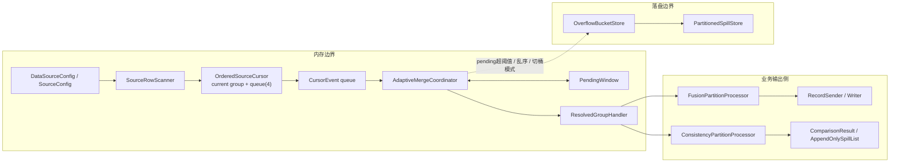
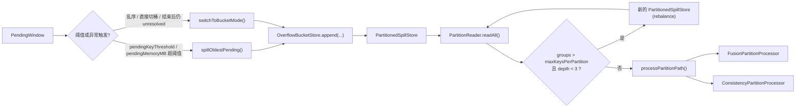

# SortMerge 内存流转图与说明

生成日期: 2026-03-27

## 1. 背景说明

本文只描述 `sortmerge` 实验链路中，数据在内存里的流转方式，以及何时从纯内存等待切换到 spill / hybrid 路径。

本文不重复展开 `part1` 中“全量拉取 -> 文件桶”的背景，也不重复讲 `implementation-progress.md` 中的整体交付结论。这里聚焦的是：

- `fusion-sortmerge`
- `consistency-sortmerge`
- `core.sortmerge`

对应当前代码主干：

- `AdaptiveMergeCoordinator`
- `OrderedSourceCursor`
- `PendingWindow`
- `OverflowBucketStore`
- `AdaptiveSortMergeFusionExecutor`
- `AdaptiveSortMergeConsistencyExecutor`

一句话概括当前实现：

- 每个 source 都是流式扫描
- 连续相同 key 的记录先在 cursor 内折叠成 group
- 只有“尚未判定的 key 的首条记录”会短暂停留在内存窗口里
- 当等待窗口超阈值时，把未决 key 写入 overflow bucket，后续以 hybrid 方式继续处理

## 2. 总体流转图

主链路说明：

1. `SourceRowScanner` 从数据库或文件源按行扫描，不在这里聚合全量数据。
2. `OrderedSourceCursor` 把连续同 key 的记录折叠成一个 `OrderedKeyGroup`。
3. `CursorEvent queue` 只在 cursor 和 coordinator 之间传递很小的事件窗口，当前容量是 `4`。
4. `AdaptiveMergeCoordinator` 决定当前 key 是继续等待、立即归并，还是转入 spill / hybrid。
5. 能直接判定的 key 会走 `ResolvedGroupHandler`，进入 `fusion` 或 `consistency` 的业务处理器。
6. 不能继续在内存里等待的 key，会被写到 `OverflowBucketStore`，后续走 overflow 分区处理。

## 3. 纯 SortMerge 内存流转说明

### 3.1 从 source 到 group

每个 source 的数据流，在纯 sortmerge 路径下经过如下内存阶段：

1. `SourceRowScanner.scan(...)`
   - 对数据库源调用 `plugin.scanQuery(...)`
   - 对文件源调用 `fileHelper.readFile(...)`
   - 每次只把当前行交给 consumer，不缓存全量 rows

2. `OrderedSourceCursor.GroupAccumulator`
   - 维护当前正在累积的 `currentKey`
   - 只保留该 key 的第一条记录 `firstRow`
   - 同 key 后续记录不继续堆积，只增加 `duplicateCount`
   - 一旦 key 变化，就发出一个 `OrderedKeyGroup`

3. `CursorEvent queue`
   - 当前实现是 `LinkedBlockingQueue<CursorEvent>(4)`
   - 只作为 cursor 与 coordinator 之间的小缓冲
   - 不承担“堆很多数据再统一处理”的职责

### 3.2 从 group 到 pending window

`AdaptiveMergeCoordinator` 拿到 `OrderedKeyGroup` 后，按下面的顺序处理：

1. 更新 `duplicateIgnoredCount`
2. 检查该 source 是否发生 key 倒退
3. 如果已经进入 bucket mode，或者当前 key 小于等于 `bucketUpperBound`
   - 直接路由到 `OverflowBucketStore`
4. 否则调用 `pendingWindow.add(...)`

这里的关键点是：

- `PendingWindow` 保存的不是完整组
- 它只保存“每个未决 key 下，每个 source 的首条记录”
- 因此内存窗口增长单位是“未决 key 数 * source 数”，不是“总记录数”

### 3.3 从 pending window 到 resolved handler

`resolveReadyKeys(...)` 会不断尝试处理窗口里最小的 key。

当一个 key 满足以下任一条件时，它就可以出窗口：

- 所有 source 都已经给出了该 key 的首条记录
- 某些 source 没给出该 key，但这些 source 已经读到了更大的 key
- 某些 source 已经结束扫描

一旦可判定：

1. 从 `PendingWindow` 删除该 key
2. 复制 `firstRowsBySource`
3. 交给 `ResolvedGroupHandler`
4. 更新 `mergeResolvedKeyCount`

这一步意味着：

- 纯 sortmerge 的核心内存压力来自“等待中的 key”
- 已经可判定的 key 会立即释放窗口占用

### 3.4 内存对象说明表

| 组件 | 内存中保存的内容 | 增长驱动 | 释放时机 | 是否与总数据量线性相关 |
| --- | --- | --- | --- | --- |
| `SourceRowScanner` | 当前扫描到的一行 `Map<String, Object>` | 当前输入行 | consumer 返回后即可被回收 | 否 |
| `OrderedSourceCursor` | `currentKey`、`firstRow`、`duplicateCount`、`groupRecords` | 当前 source 的连续同 key 记录段 | 该 group 发出后重置 | 否 |
| `CursorEvent queue` | 最多 `4` 个 `CursorEvent` | coordinator 消费速度慢于 producer 时 | event 被取走后释放 | 否 |
| `OrderedKeyGroup` | `key`、`firstRow`、`duplicateCount`、`scannedRecords` | 每个连续 key 段产生一个 group | 被 coordinator 消费后释放 | 否 |
| `PendingWindow` | 未决 key 对应的 `firstRowsBySource` 和估算字节数 | 等待其他 source 追平或跨过当前 key | key 被 resolve 或 spill 后释放 | 否，取决于未决 key 数 |
| `AdaptiveMergeCoordinator` | `lastReadKeyBySource`、`cursorIndex`、`bucketUpperBound`、统计对象 | source 数与执行状态 | 执行结束时释放 | 否 |
| `FusionPartitionProcessor` | 当前待融合 key 的 sourceRows、`FusionEngine` 运行态 | 当前 key 的 source 首条记录数 | 当前 key 处理完成后释放 | 否 |
| `ConsistencyPartitionProcessor` | 当前待比对 key 的 sourceRows、临时 `DifferenceRecord` | 当前 key 的 source 首条记录数 | 当前 key 处理完成后释放 | 否 |
| `AppendOnlySpillList` | 结果文件句柄和 offsets 索引 | 差异结果或 resolvedRows 条数 | executor 结束后关闭 | 与输出结果数量相关，不与源总量直接绑定 |

### 3.5 纯 SortMerge 的内存边界结论

当前代码下，纯 sortmerge 路径的核心约束可以总结成两句：

1. 每个 source 不持有全量 rows，只持有“当前 group + 小 queue”
2. 全局真正会增长的，是 `PendingWindow` 中未决 key 的首条记录集合

因此它规避掉的是：

- “所有源全量数据一起进内存”的问题

但它仍然可能遇到：

- 多源错位很大，导致 `PendingWindow` 长时间膨胀

这就是 hybrid / spill 分支存在的原因。

## 4. hybrid / spill 分支流转图

### 4.1 触发 spill / hybrid 的几种情况

当前实现中，进入 overflow 主要有几类触发条件：

1. `PendingWindow` 的 key 数量超过 `pendingKeyThreshold`
2. `PendingWindow` 的估算字节数超过 `pendingMemoryBytes`
3. 某个 source 被检测到 key 顺序倒退
4. 所有 cursor 结束后，窗口中仍有无法直接 resolve 的 key

### 4.2 超阈值时不是失败，而是 spill unresolved keys

当前实现事实是：

- 超阈值时默认不是直接失败
- 会优先走 `spillOldestPending()`
- 只把最老的一批 unresolved key 写入 overflow bucket

`spillOldestPending()` 做的事是：

1. 从 `PendingWindow` 中移除最老的一批 entry
2. 把 entry 里的每个 source 首条记录写入 `OverflowBucketStore`
3. 更新 `mergeSpilledKeyCount`
4. 把 `executionEngine` 标记为 `hybrid`

注意这里 spill 的是：

- 未决 key 的首条记录

不是：

- 原始源数据的全量副本

### 4.3 进入 overflow 后的后续行为

一旦有 key 已经写到 bucket，coordinator 会记录一个 `bucketUpperBound`。

后续如果新读到的 key 满足：

- `key <= bucketUpperBound`

则它可能直接走 `appendGroupToBucket(...)`，不再尝试回到内存窗口。

这意味着：

- overflow 不是一次性的“清一批再完全恢复纯 sortmerge”
- 它会逐步把部分 key 区间固定路由到 bucket 路径

### 4.4 overflow 分区处理

overflow 数据不会直接一次性读回内存，而是：

1. 通过 `PartitionedSpillStore` 按 partition 落盘
2. 后续用 `PartitionReader` 逐个 partition 读取
3. 在 `processPartitionPath(...)` 里重新组装 `groups`
4. 如果单个 partition 中 key 仍太多，就继续 rebalance
5. 最终再交给 `FusionPartitionProcessor` 或 `ConsistencyPartitionProcessor`

当前 rebalance 深度上限是：

- `MAX_REBALANCE_DEPTH = 3`

### 4.5 当前已验证的结论

结合 `part2/sortmerge-mysql-benchmark-20260327.md` 的实测结果，当前边界已经确认：

- `100` 条：纯 `sortmerge`
- `10000` 条：纯 `sortmerge`
- `1000000` 条：进入 `hybrid`

并且已经验证：

- 内容正确
- `hybrid` 后不保证全局输出顺序

当前百万级实测中已经观测到融合输出顺序回退样例：

- `1000000 -> 92889`

因此：

- 当前 hybrid 的正确性基线是“内容正确”
- 不是“spill 后仍保持全局 key 有序输出”

## 5. Fusion / Consistency 差异说明

`fusion-sortmerge` 与 `consistency-sortmerge` 共享同一套 sortmerge 骨架，但在 resolved handler 之后走向不同。

### 5.1 共享部分

两条链路共享：

- `SourceRowScanner`
- `OrderedSourceCursor`
- `AdaptiveMergeCoordinator`
- `PendingWindow`
- `OverflowBucketStore`

也就是说，在“如何扫描 source、如何等待 key、何时 spill”这部分，它们是同一套机制。

### 5.2 Fusion 分支

入口类：

- `AdaptiveSortMergeFusionExecutor`

关键特点：

1. `ResolvedGroupHandler` 会把当前 key 的 `firstRowsBySource` 组装成 `groups`
2. 调用 `FusionPartitionProcessor.processGroups(...)`
3. `FusionPartitionProcessor` 内部通过 `FusionEngine.fuseRows(...)` 生成单条 `Record`
4. 通过 `RecordSender.sendToWriter(...)` 直接增量输出
5. 同时调用 `updateIncrementalValues(...)` 更新增量位点

Fusion 路径的内存重点：

- 当前 key 的 sourceRows
- `FusionContext` 中的少量运行态
- 结果不会先积满再统一返回，而是边处理边写 writer

Fusion 路径的当前边界：

- 纯 sortmerge 时可保持有序输出
- hybrid overflow 收尾后，内容正确，但不保证全局有序

### 5.3 Consistency 分支

入口类：

- `AdaptiveSortMergeConsistencyExecutor`

关键特点：

1. `ResolvedGroupHandler` 把当前 key 的 sourceRows 交给 `ConsistencyPartitionProcessor`
2. `DataComparator.compareKeyGroup(...)` 生成 `DifferenceRecord`
3. 差异结果写入 `AppendOnlySpillList<DifferenceRecord>`
4. resolved rows 写入 `AppendOnlySpillList<Map<String, Object>>`
5. 若开启自动更新，还会在 batch 级别生成 `updatePlan` 并调用 `UpdateExecutor`

Consistency 路径的内存重点：

- 当前 key 的 sourceRows
- 当前 batch 的 resolved differences
- 结果集合本体走 `AppendOnlySpillList` 文件承载，内存里主要保留 offsets

Consistency 路径的输出特征：

- 不是直接往 writer 发融合后的单条 `Record`
- 而是累积比较结果、resolved rows、update result 等结构化产物

### 5.4 两者的对照结论

| 维度 | Fusion | Consistency |
| --- | --- | --- |
| 入口 | `AdaptiveSortMergeFusionExecutor` | `AdaptiveSortMergeConsistencyExecutor` |
| resolved handler 后的处理器 | `FusionPartitionProcessor` | `ConsistencyPartitionProcessor` |
| 当前 key 的输出 | 一条融合后的 `Record` | 一个 `DifferenceRecord` 或 consistent skip |
| 输出承载方式 | `RecordSender` 直接增量发送 | `ComparisonResult` + `AppendOnlySpillList` |
| spill 后再处理 | `processPartitionPath -> FusionPartitionProcessor` | `processPartitionPath -> ConsistencyPartitionProcessor` |
| 当前已知大数据边界 | hybrid 下内容正确但不保证全局有序 | hybrid 下结果正确，重点关注差异和 update 结果 |

## 6. 结论

当前 `sortmerge` 实验链路的数据内存流转，可以浓缩成下面三句话：

1. 源数据不是全量进内存，而是按行扫描、按连续 key 折叠、按未决 key 等待。
2. 内存窗口真正持有的是“未决 key 下每个 source 的首条记录”，不是所有原始 rows。
3. 当等待窗口无法继续控制时，系统会 spill unresolved keys 并进入 hybrid；此时内容仍正确，但融合输出顺序不再保证全局有序。

如果下次会话要继续深入，最值得直接展开的两个方向是：

- 如何让 hybrid 后最终输出仍保持全局有序
- 如何进一步降低百万级场景下的内存峰值

